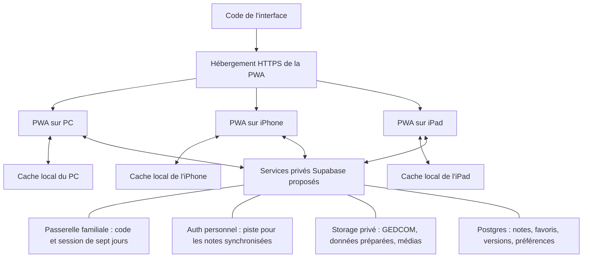

# Héritage — carnet de bord du projet généalogique

> **État au 1er octobre 2026 : application 0.11.4 inchangée, documentation 0.12.6. Validation globale sur iPhone/iPad réels confirmée par l’utilisateur. Phase active : [hors connexion, mises à jour, fermeture et expiration de l’accès](docs/etape-5-hors-connexion-mises-a-jour.md). 137 tests automatiques réussis ; migration réelle vers la version de test 0.11.4 avec note conservée contrôlée sur PC. Aucun nouveau fichier applicatif à publier ni script Supabase pour ce lot. Résultats hors connexion matériels et expiration naturelle encore attendus.**
>
> La direction visuelle validée associe **Héritage** et **Constellation**. La cible est une application commune au **PC, à l’iPhone 15 Pro et à l’iPad Pro 11 pouces de 3e génération**, adaptée au portrait et au paysage. La généalogie reste en consultation seule ; les notes personnelles sont conservées séparément du GEDCOM.

| Repère | État documenté |
|---|---|
| Version de ce carnet de bord | **0.12.6 — validation hors connexion et accès** |
| Dernière mise à jour | **01/10/2026** |
| Version de l'application livrée | **0.11.4 locale, publication utilisateur à effectuer** ; dernière version distante contrôlée 0.11.1 ; synchronisation personnelle non livrée |
| Nom de travail | **Héritage**, avec la notion d'« Atlas familial » ; nom définitif à confirmer |
| Données actuelles | **16 262 personnes**, **4 440 familles**, **970 sources**, GEDCOM de **11,36 Mo** ; export du 24/09/2026 |
| Interface actuelle | `app/`, raccordée aux **16 262 personnes** ; identité Héritage + Constellation et disposition inspirée de MyHeritage |
| Photographies locales | **1 405 références**, **1 381 ressources**, **1 116 fichiers distincts** après dédoublonnage, **314,71 Mo** |
| Tests automatisés persistants dans le projet | **137** via `npm test` (100 JavaScript + 37 Python) ; limite exacte d’expiration, copies hors connexion, cache plein et migration réelle avec conservation d’une note contrôlés |
| Hébergement / base distante / tâche cron | GitHub Pages publié en 0.11.1 ; accès familial Supabase fonctionnel confirmé par l’utilisateur après correction des paramètres ; essais matériels et expiration réelle à consigner ; aucune tâche cron configurée |
| Consigne active | **Reprise autorisée par l’utilisateur le 30/09/2026**, après la pause ; continuer par livraisons locales sans code familial |

Ce fichier est le **carnet de bord officiel du projet**. Il décrit ce qui existe, les décisions prises, les propositions et les travaux restant à réaliser. Les anciennes notes restent utiles pour comprendre le cheminement, mais les orientations les plus récentes sont réunies ici. Une nouvelle instruction explicite de l'utilisateur prime sur ce document ; le README doit alors être actualisé.

**Accès rapide :** [ouvrir l’application publiée](https://christophedesmottes.github.io/heritage/), [ouvrir la copie locale PC](http://127.0.0.1:8767/) ou [comparer les cinq formats sur PC](http://127.0.0.1:8767/review.html). Les guides des étapes [1](docs/etape-1-cadrage.md), [2](docs/etape-2-arbre-complet.md) et [3](docs/etape-3-carnet-autonomie.md) gardent l’historique de conception. Sur Apple, utiliser l’adresse publiée. La première ouverture et la préparation nécessitent Internet et un accès familial valide ; le hors connexion doit ensuite être vérifié dans ce même contexte. Le serveur local n’est nécessaire que pour la copie PC.

**Pour continuer maintenant :** suivre la [fiche de validation iPhone/iPad](docs/etape-4-validation-appareils.md) avec [l’application publiée](https://christophedesmottes.github.io/heritage/), dans Safari puis depuis son icône. Le développement local reste disponible [sans code sur le PC](http://127.0.0.1:8767/). Le [guide de sauvegarde complète](docs/etape-3-sauvegarde-complete.md) décrit la création du ZIP local et sa restauration. Les notes sont propres à chaque appareil et contexte : exporter/restaurer le Carnet pour les déplacer. Aucune synchronisation personnelle livrée.

**Comparer les notes depuis 0.8.1 :** **Carnet → Choisir une sauvegarde → Aperçu de la restauration**. Parcourir les différences avec les flèches ; pour chaque note, garder le texte actuel (défaut) ou réunir les deux textes. Cliquer ensuite sur **Restaurer le carnet**, ou **Annuler**. Une identité différente n’est jamais réunie automatiquement. Les sauvegardes restent limitées au même export généalogique. Le fichier choisi reste à conserver, notamment pour les fiches ignorées. [Guide détaillé](docs/etape-3-restauration-carnet.md).

**Constat de reprise :** `package.json` et le cache applicatif annonçaient déjà **0.8.0**, avec **96 tests** (71 JavaScript + 25 Python), alors que ce carnet décrivait 0.7.0 et 91 tests. Les fichiers existants, dont les préparatifs de liens d’essai hébergés, sont conservés. Cette reprise ajoute huit tests de logique et six tests navigateur ; elle ne déduit aucun déploiement distant de la seule présence de ces préparatifs.

**Ordre de travail actuel :** vérifier gestes, rotations, clavier et installation sur iPhone/iPad réels ; contrôler hors connexion, conservation du Carnet, fermeture et expiration de l’accès publié ; corriger les anomalies constatées ; définir puis construire la synchronisation des carnets par utilisateur ; préparer les futurs réimports. Les calculs de parenté, cartes et livrets restent des enrichissements ultérieurs. Les anciennes sections de livraison conservent leur état historique.

## Livraison à publier par l’utilisateur

**Consigne la plus récente :** accès avec PIN familial de quatre chiffres ; push GitHub et actions Supabase réalisés par l’utilisateur. Le [guide de livraison](livraison-0.10.0/LIRE-MOI.md) donne les opérations dans l’ordre. Pousser uniquement le contenu de `livraison-0.10.0/github/`. Les données de `stockage-prive/` vont seulement dans le bucket privé Supabase. La mise en production est désormais préparée, mais n’a pas été exécutée. Le contrôle HTTP du 30 septembre, avant cette livraison, répondait encore 503 « Accès familial non configuré ».

## Reprise et livraison du 30 septembre

La pause a été levée par la nouvelle demande utilisateur. **Le lot de sauvegarde complète locale est terminé.** Dans **Carnet → Tout sauvegarder → Créer la sauvegarde complète**, le programme rassemble GEDCOM, arbre, photos, programme et Carnet enregistré dans un seul ZIP privé. Le [guide complet](docs/etape-3-sauvegarde-complete.md) explique la reprise avec ou sans le dossier original. La restauration du ZIP utilise encore l’outil local ou une extraction suivie du contrôle ; les notes sont importées explicitement depuis le fichier `carnet.json`.

**Preuves conservées :** `analysis/tests-0.9.0.log` et `analysis/complete-backup-validation-2026-09-30.json`. ZIP réel : `C:/Users/cdesmottes/Downloads/heritage-complet-2026-09-30T08-16-49-760Z.zip`, **316 342 087 octets**, **16 262 personnes**, **4 440 familles**, **1 116 photos**, **1 147 fichiers inventoriés**. La copie `artifacts/restauration-complete-2026-09-30/` a été ouverte dans le navigateur sur 8773 : 21 cartes autour de Christophe, portrait local chargé, Carnet et commande de sauvegarde disponibles, sans code familial. Le serveur temporaire est arrêté après contrôle ; la consultation habituelle reste sur 8767.

Le Carnet inclus était vide dans ce navigateur ; les notes non vides sont couvertes par les tests fictifs, sans lecture des carnets d’autres navigateurs. Les cinq dimensions internes ont été vérifiées via `review.html`, sur l’écran de sauvegarde ouvert : **1440×960, 393×852, 852×393, 834×1194 et 1194×834**, sans débordement horizontal. Cette vérification remplace la tentative de redimensionnement non effective consignée pendant la pause. Elle ne constitue pas un essai matériel Apple.

**Suite proposée :** ergonomie tactile, rotation, clavier et installation PWA ; essais physiques après préparation d’un accès privé ; vérification de l’hébergement et de Supabase avant production, code familial lors de la finalisation ; synchronisation des carnets personnels après définition de leur séparation. Les calculs de parenté, cartes et livrets restent des enrichissements ultérieurs. Une copie du ZIP sur un support privé extérieur au PC reste à effectuer sur le support choisi par l’utilisateur.

## Sommaire

1. [Intention et cheminement de la conversation](#1-intention-et-cheminement-de-la-conversation)
2. [Décisions, propositions et points ouverts](#2-décisions-propositions-et-points-ouverts)
3. [Le GEDCOM : contenu et limites de l'analyse](#3-le-gedcom--contenu-et-limites-de-lanalyse)
4. [Ce qui existe réellement dans les fichiers](#4-ce-qui-existe-réellement-dans-les-fichiers)
5. [Fonctionnement des maquettes](#5-fonctionnement-des-maquettes)
6. [Reprendre et consulter le travail existant](#6-reprendre-et-consulter-le-travail-existant)
7. [Architecture proposée pour l'application](#7-architecture-proposée-pour-lapplication)
8. [PC, iPhone et iPad : affichage et lancement](#8-pc-iphone-et-ipad--affichage-et-lancement)
9. [Données, synchronisation et sauvegardes](#9-données-synchronisation-et-sauvegardes)
10. [Supabase gratuit et prévention de la mise en pause](#10-supabase-gratuit-et-prévention-de-la-mise-en-pause)
11. [Fonctionnalités et idées d'évolution](#11-fonctionnalités-et-idées-dévolution)
12. [Livraisons progressives et décisions à prendre](#12-livraisons-progressives-et-décisions-à-prendre)
13. [Vérifications effectuées et tests à prévoir](#13-vérifications-effectuées-et-tests-à-prévoir)
14. [Règles de maintenance du carnet de bord](#14-règles-de-maintenance-du-carnet-de-bord)
15. [Historique des évolutions](#15-historique-des-évolutions)
16. [Références documentaires](#16-références-documentaires)
17. [Tableaux de suivi officiels](#17-tableaux-de-suivi-officiels)

## 1. Intention et cheminement de la conversation

Le besoin initial était de rendre un arbre généalogique volumineux **exploitable, agréable à parcourir et transmissible**. Trois formes de restitution ont été évoquées : un dossier complet, une application et une page HTML interactive. Le design compte beaucoup pour l'utilisateur. La demande initiale invitait aussi à explorer des idées originales sans se limiter au dessin classique d'un arbre.

Le dossier unique de milliers de pages serait difficile à lire. L'orientation proposée est donc un **atlas familial interactif**, complété éventuellement par des livrets ciblés : une personne, un couple, une branche, un patronyme ou un village. Une première démonstration sur des personnes fictives a illustré la navigation familiale, le temps et les liens de parenté.

Après réception du GEDCOM, le volume estimé de 15 000 à 16 000 personnes a été mesuré : **16 154 personnes**. Ce volume est compatible avec l'application envisagée, sous réserve d'une conception adaptée et de mesures sur les appareils cibles. Il ne faut pas tenter de dessiner les 16 154 personnes en même temps : la navigation doit afficher progressivement les proches et les branches utiles.

Trois propositions visuelles utilisant un petit extrait réel ont ensuite été produites :

- **Héritage** : une présentation éditoriale, chaleureuse, centrée sur les vies et la lecture.
- **Constellation** : une présentation centrée sur les relations et la sélection dans un arbre.
- **Atelier** : un répertoire plus fonctionnel, orienté recherche et informations manquantes.

L'utilisateur a choisi **un mélange des deux premières**, puis l'a validé. La maquette combinée reprend l'identité d'Héritage et la navigation de Constellation. Atelier reste une piste pour un éventuel espace de recherche ; il ne constitue pas la direction visuelle retenue.

Une application Windows avec **Tauri et SQLite** avait d'abord été proposée. La demande d'utilisation sur **PC, iPhone 15 Pro et iPad Pro**, dans les deux orientations, a ensuite conduit à privilégier une **application web installable, ou PWA**, avec une base de code commune. L'utilisateur a demandé de ne pas lancer immédiatement sa construction et a souhaité clarifier les étapes de livraison.

Les échanges suivants ont porté sur le lancement depuis une icône iOS, l'hébergement éventuel sur GitHub, les moyens d'éviter trois imports manuels du GEDCOM, puis l'utilisation de Supabase et de son offre gratuite. Enfin, une interrogation régulière via **cron-job.org** a été envisagée pour réduire le risque de pause du projet gratuit.

La demande du 23 septembre 2026 institue ce README comme mémoire officielle et tableau de suivi. **Les échanges d'architecture ne constituent pas une mise en service : aucun compte, hébergement, transfert du GEDCOM ou cron n'a été configuré.**

Après cette première documentation, l'utilisateur a autorisé le démarrage et confirmé **la consultation en premier**, avec notes et favoris à l'étape 3. Il a précisé posséder un **iPad Pro 11 pouces de 3e génération**. L'étape 1 produit désormais un prototype local avec recherche, sélection, portraits, recentrage familial et cinq formats de prévisualisation. Les services externes restent non configurés.

L'utilisateur a ensuite fourni une capture de **MyHeritage** pour rapprocher la consultation de cette disposition, en rappelant explicitement qu'il ne souhaite pas créer de personne. La révision **0.2.0** du prototype suit cette demande : cartes compactes, arbre dominant, fiche à gauche, recherche et outils de cadrage. Cette capture sert de référence visuelle uniquement ; le compteur de son site n'est pas utilisé pour remplacer les 16 154 personnes mesurées dans le GEDCOM fourni.

L’utilisateur a autorisé la suite après la version 0.2.1. Le premier lot de l’étape 2 est livré en **0.3.0** : import direct du GEDCOM complet, ouverture des branches, recherche de toutes les personnes et choix des unions. L’accueil est centré sur **Christophe Desmottes**, identifié dans le fichier et dans la capture de référence, avec l’union comportant les deux enfants. Depuis la **version 0.5.0 du 24/09/2026**, toutes les unions de la personne centrale sont affichées ensemble ; le sélecteur initial a été remplacé à la demande de l’utilisateur.

Le 24/09/2026, après le constat des liens photo expirés de l’export d’août, l’utilisateur fournit un nouvel export et autorise explicitement **l’actualisation de l’arbre et des photos**. La version **0.5.3** importe 108 personnes supplémentaires et 44 familles supplémentaires ; aucun identifiant de personne antérieur ne disparaît et 35 noms changent. Les images accessibles dans ce nouvel export sont récupérées sur le PC puis rattachées aux fiches. Le portrait de Christophe et sa galerie sont vérifiés dans le navigateur. Les anciens résultats restent conservés pour comparaison.

Le 25/09/2026, l’utilisateur demande d’avancer dans les étapes. Le lot **0.6.0** débute l’étape 3 sans attendre l’hébergement : carnet personnel local, notes, favoris, reprise de navigation, export/restauration et préparation hors connexion. La consultation complète de l’étape 2 reste disponible ; les essais sur les appareils Apple physiques restent ouverts.

Le 26/09/2026, après confirmation que rien n’a été envoyé à Supabase ou GitHub, l’utilisateur autorise la suite et indique un projet Supabase existant : `https://plexhqgdxdejijgxviie.supabase.co`. La préparation cloud **0.1.0** produit des règles SQL testées et une archive privée vérifiée. L’ouverture du tableau de bord renvoie à la connexion ; aucune mutation distante n’a eu lieu. Le choix usage individuel/partage familial a été demandé ; le schéma initial est limité à un propriétaire, sans attribuer encore de droits à un compte réel.

## 2. Décisions, propositions et points ouverts

| Sujet | Niveau de décision | Conséquence |
|---|---|---|
| Importance du design | Exigence exprimée | Soigner lisibilité, typographie, espace et navigation ; ne pas réduire le projet à un outil technique |
| Mélange Héritage + Constellation | **Validé par l'utilisateur** | Référence pour la suite du design |
| PC + iPhone 15 Pro + iPad Pro | Exigence exprimée | Prévoir une expérience commune adaptée aux trois appareils |
| Portrait et paysage | Exigence exprimée | Tester les deux orientations et les changements d'orientation |
| Construction | **Autorisée par l'utilisateur le 23/09/2026** | Commencer par le cadrage et le prototype responsive, puis avancer par livraisons |
| README officiel | **Demandé par l'utilisateur** | Actualiser description, version, tests, historique et suivi à chaque évolution |
| PWA | Cible privilégiée pour les trois appareils | **0.6.0** : manifeste, icônes, service worker et préparation locale ; HTTPS privé et installation Apple à valider |
| Stockage central et synchronisation | Besoin exploré pour éviter les imports manuels sur chaque appareil | Choisir une politique de données et de synchronisation |
| GitHub / GitHub Pages | Option pour le code et l'interface statique | Aucun dépôt distant ni déploiement configuré |
| Supabase Auth + Storage + Postgres | Projet existant inspecté et socle privé installé | Auth personnel reste optionnel ; consultation familiale par code, sans e-mail, validée |
| Cron externe de contrôle | Possibilité discutée | Fréquence, endpoint et configuration non réalisés |
| Consultation ou modification de la généalogie | **Consultation d'abord, validée par l'utilisateur** | Première version sans édition généalogique ; notes et favoris à l'étape 3 |
| Code pendant le développement | **Reporté à la mise en production finale, à la demande de l’utilisateur** | Continuer la version locale sans code ; conserver la passerelle distante fermée jusqu’à configuration et validation |
| Usage personnel ou accès familial | **Accès familial par adresse + code, validé le 26/09** | Arbre et photos partageables ; notes personnelles séparées, non synchronisées pour le moment |
| Médias disponibles hors connexion | Premier fonctionnement livré en **0.6.0** | Après préparation : cache des photos consultées ; téléchargement de toute la bibliothèque sur demande, avec progression et reprise |
| Technologies du prototype | HTML, CSS et JavaScript en modules ; cartes HTML et liens SVG | Aucune dépendance distante ; outils de l'import et du graphe complet à réévaluer selon les besoins |
| Modèle d'iPad | **iPad Pro 11 pouces de 3e génération** | Deux orientations prévues ; version d'iPadOS encore à relever |
| Consultation inspirée de MyHeritage | **Demandée par l’utilisateur, capture fournie le 23/09/2026** | Grand arbre, cartes compactes et fiche repliable ; aucune création ni modification de personne |
| Unions simultanées | **Demandées le 24/09/2026, nouvelle capture fournie** | Valérie et Rakhel visibles ensemble ; enfants conservés sous leur propre union ; rectangles gris pour explorer chaque branche |

## 3. Le GEDCOM : contenu et limites de l'analyse

### 3.1 Source originale — historique du 21 août

Fichier fourni :

```text
P:\Perso CDS\Généalogie\20260821_a69808_4714667jrpna88892a0667_A.ged
```

Export **MyHeritage**, daté du **21 août 2026**, au format déclaré **GEDCOM 5.5.1 / UTF-8**. Première analyse réalisée le **22 septembre 2026**. Le fichier original a été lu sans modification. Aucun téléchargement de ses médias ni envoi de l'arbre vers un hébergement externe n'a été effectué dans ce travail.

Empreinte SHA-256 enregistrée et contrôlée pendant l'analyse :

```text
e07b9ef406b9d08c7bdab6899956137804b0eb7efa3d7b14106162fa4dd91307
```

Le lecteur `P:` reste nécessaire pour le script historique `analyze_gedcom.py`, qui conserve ce chemin. Depuis la version 0.5.3, la préparation applicative utilise par défaut la copie privée du nouvel export dans `sources/2026-09-24.ged` : elle ne dépend plus de `P:`. Aucun sélecteur de fichier n’est encore proposé dans l’interface.

### 3.2 Résultats mesurés sur l’export du 21 août — historique

| Élément | Résultat |
|---|---:|
| Taille | 11 323 406 octets, soit 11,32 Mo décimaux, environ 10,80 Mio |
| Personnes, enregistrements `INDI` | 16 154 |
| Familles, enregistrements `FAM` | 4 396 |
| Fiches de sources, enregistrements `SOUR` | 970 |
| Personnes avec une date de naissance renseignée | 13 243 |
| Personnes avec une date de décès renseignée | 8 935 |
| Personnes avec au moins une note directement rattachée | 378 |
| Personnes avec au moins un média directement rattaché | 550 |
| Structures de notes dans l'export | 1 569 |
| Citations de sources comptées par le script | 16 943 |
| Libellés de lieux distincts | 6 387 |
| Références à des médias | 1 405 |
| Adresses de médias distinctes | 1 381 |
| Références de médias en ligne | 1 405 ; aucune référence locale dans ce relevé |
| Groupes reliés selon le graphe construit par le script | 13 |
| Personnes du groupe principal | 14 986 |
| Identifiants de personnes manquants dans les références des familles | 0 |
| Identifiants d'enregistrement dupliqués | 0 |
| Lignes `CONC` réunies avant décodage | 8 127 |
| Lignes textuelles atypiques récupérées par heuristique | 261 |
| Lignes restant non analysées après cette récupération | 0 |

Tailles des groupes calculés : **14 986, 457, 321, 168, 86, 57, 18, 17, 12, 12, 12, 7 et 1**. Le futur répertoire doit permettre de trouver aussi les personnes extérieures au groupe principal.

Ces résultats sont conservés dans [audit.json](<C:/Users/cdesmottes/Documents/Codex/Généalogie/analysis/audit.json>).

### 3.3 Interprétation et limites

- Une date renseignée peut être partielle, approximative ou encadrée par une période. Elle ne correspond pas nécessairement à un jour certain.
- L'absence de date de décès ne prouve pas qu'une personne est vivante. Une éventuelle règle de masquage des personnes vivantes devra tenir compte de l'incertitude.
- Les **6 387 libellés** ne sont pas autant de lieux géographiques différents. Plusieurs écritures de Givry désignent potentiellement le même lieu ; une normalisation sera nécessaire avant une cartographie fiable.
- Les **970 fiches de sources** ne signifient pas qu'il existe 970 actes numérisés accessibles. La présence d'une citation ne vérifie pas l'exactitude de l'information citée.
- L'absence d'identifiants dupliqués ne prouve pas l'absence de personnes enregistrées plusieurs fois sous des identifiants différents.
- Le contrôle des références porte ici sur les personnes mentionnées dans les familles. Ce n'est pas une validation exhaustive de tous les pointeurs GEDCOM.
- Le nombre de groupes dépend des relations que construit le script. Il ne constitue pas un audit complet de toutes les formes de filiation ou de tous les cas GEDCOM.
- Lors de cet audit initial, les médias étaient uniquement des **liens distants** et leur accessibilité restait inconnue. La récupération effectuée depuis l’export du 24 septembre est décrite en section 3.6 ; ses copies locales existent désormais.
- Les données sont des assertions issues du fichier fourni. Les filiations, événements et récits n'ont pas été confrontés systématiquement aux actes originaux.

### 3.4 Fonctionnement du script d'analyse

[analyze_gedcom.py](<C:/Users/cdesmottes/Documents/Codex/Généalogie/analyze_gedcom.py>) utilise la bibliothèque standard Python : aucune installation de dépendances Python tierces n'est nécessaire pour ce script.

Son déroulement est le suivant :

1. Lire le GEDCOM en octets et calculer son empreinte.
2. Réunir les continuations `CONC` **avant** le décodage UTF-8. L'export contient des caractères multioctets coupés entre deux lignes ; décoder d'abord provoquerait des problèmes.
3. Construire une représentation hiérarchique des lignes par niveau, balise, valeur, enfants et identifiant.
4. Rattacher les lignes textuelles hors syntaxe au texte précédent lorsqu'un contexte existe. Cette récupération préserve du texte, mais doit être réexaminée pour un importeur de production.
5. Extraire les personnes, familles, premiers événements de naissance/décès/mariage et quelques attributs utiles à l'analyse.
6. Construire les relations parents, partenaires et enfants, puis calculer des statistiques et des groupes reliés.
7. Écrire `audit.json` et `people-index.json` dans `analysis/` ; afficher aussi des candidats historiques pour les maquettes.

`people-index.json` contient deux dictionnaires :

```text
people[identifiant GEDCOM]
  id, name, birth {date, place}, death {date, place}, sex, occupation
  fams, famc, source_count, has_note, has_media
  parents[], partners[], children[]

families[identifiant GEDCOM]
  id, parents[], children[], marriage {date, place}
```

**Cet index est une extraction partielle, pas une conversion intégrale et réversible du GEDCOM.** Il ne contient pas tous les textes de notes, détails de sources, événements, médias, qualificatifs de filiation ou balises spécifiques. Le champ `source_count` d'une personne ne compte que ses citations directement rattachées, pas toutes celles présentes sous ses événements. Les métadonnées de format inscrites dans le résumé sont adaptées à ce fichier ; le script n'est pas un détecteur universel de formats.

Le temps enregistré pour l'analyse est d'environ **1,9 seconde** sur l'environnement utilisé. Il ne préjuge ni du temps de chargement de l'application finale ni de sa fluidité sur iPhone ou iPad.

### 3.5 Import applicatif de la version 0.3.0 — historique

`scripts/gedcom.py` et `scripts/prepare_tree.py` lisent directement le fichier UTF-8, sans dépendre de l’ancien index. Résultat : **16 154 personnes, 4 396 familles et 970 sources**. Les noms sont lus dans les balises de nom, en conservant les particules et variantes. Les dates restent textuelles, avec leurs incertitudes. Les événements, adresses, notes, citations et références de médias utiles à la consultation sont préparés.

Les **8 127 continuations `CONC`** sont réunies en octets avant le décodage UTF-8. Le nouvel import signale **230 lignes de texte atypiques**, conservées avec leurs numéros de ligne dans le rapport. Ce compteur appartient au nouvel algorithme et ne remplace pas rétroactivement les 261 récupérations de l’analyse historique. Les balises non interprétées restent dans `analysis/records.json`, qui conserve l’arbre complet des enregistrements après réunion des continuations ; le GEDCOM original reste la référence pour le fichier exact.

Un lien `FAMC` avec qualification **Adopted** est déclaré sur `@I502221@` vers `@F500310@`, alors que la famille omet cette personne dans sa liste d’enfants. L’import conserve ce lien explicitement déclaré, complète la relation réciproque dans les données de consultation et le signale sur la fiche et dans `analysis/import-report.json`. Aucune filiation n’est inventée et le fichier source n’est pas modifié. Le graphe consolidé comporte **12 groupes**, dont un de **14 993 personnes**, contre 13 dans l’audit préliminaire ; la recherche couvre tous les groupes, y compris l’individu isolé.

Le JSON de consultation mesure **22 429 815 octets** ; sa version gzip **1 928 144 octets**. Le serveur négocie la compression avec le navigateur. Les données décompressées sont chargées en mémoire ; ce mécanisme ne constitue pas un cache hors connexion. L’empreinte SHA-256 de l’original est inchangée. Le lecteur prend actuellement en charge **GEDCOM UTF-8**, sans réexport ni garantie de restitution exhaustive de chaque balise dans l’interface.

### 3.6 Source actuelle et bibliothèque photographique — version 0.5.3

Nouvel export fourni : `C:\Users\cdesmottes\Downloads\f6b857_9581522655z77bagb8b1md_A.ged`, daté du **24 septembre 2026**, GEDCOM 5.5.1 / UTF-8. Une copie strictement identique est conservée dans **`sources/2026-09-24.ged`**. Les fichiers fournis restent inchangés. Empreinte SHA-256 du nouvel export :

```text
72a26859d864978f8343573676e2644e22478a921cea49ed3fa402303e36962b
```

| Mesure actuelle | Résultat |
|---|---:|
| Source | 11 361 970 octets — 11,36 Mo |
| Personnes / familles / sources | 16 262 / 4 440 / 970 |
| Comparaison des personnes avec août | 108 identifiants ajoutés, aucun retiré, 35 noms modifiés |
| Familles supplémentaires | 44 |
| Continuations `CONC` / textes atypiques récupérés | 8 127 / 230 |
| Groupes après consolidation des liens déclarés | 12 ; groupe principal de 15 101 personnes |
| JSON de consultation / gzip | 22 721 505 / 2 003 208 octets — 22,72 / 2,00 Mo |
| Références de médias / ressources distinctes | 1 405 / 1 381 |
| Fichiers image distincts conservés | 1 116 ; 314 713 786 octets — 314,71 Mo, environ 300,13 Mio |
| Références rattachées à une copie locale vérifiée | 1 405 ; aucun échec final |

Le lien `FAMC` non réciproque décrit en section 3.5 reste signalé. Les dates, noms et événements proviennent du nouvel export ; aucun rapprochement de personnes n’est déduit des seuls noms. Les rapports actuels sont `analysis/import-report.json`, `analysis/new-export-audit.json` et `analysis/validation-report.json`.

Les nouvelles URL photographiques étaient valides lors de la récupération. Leurs paramètres annoncent une expiration au **1er octobre 2026 à 18:00 UTC**. Le téléchargement utilise les adresses fournies, puis conserve les octets des images dans **`app/data/media/`**, sous un nom calculé par SHA-256. Plusieurs références peuvent pointer vers le même fichier : le dédoublonnage porte sur les octets identiques, sans fusionner les personnes ni supprimer les associations. Les recadrages et résolutions de l’export sont conservés tels quels ; une vignette récupérée n’est pas présentée comme un original en haute définition.

`analysis/media-manifest.json` relie chaque ressource à son fichier local, sa taille et son empreinte. La clé de ressource ignore la signature temporaire uniquement pour retrouver une copie existante lors d’un futur export ; elle ne permet pas de télécharger un lien expiré. `analysis/media-download-report.json` décrit la récupération ; `analysis/media-validation-report.json` vérifie les 1 405 associations et l’intégrité des fichiers. Les rapports de récupération n’exposent pas les URL signées. Le champ GEDCOM `file` reste conservé dans le corpus privé ; un champ `localFile` désigne sa copie validée.

La photo marquée **`_PRIM Y`** est choisie comme portrait principal ; à défaut, la première référence exploitable est utilisée. L’indicateur de recadrage **`_CUTOUT`** est préservé. Les cartes et la fiche de Christophe affichent son portrait noir et blanc ; sa galerie propose trois images. Les copies locales déjà récupérées restent consultables avec le serveur du PC sans accès à MyHeritage, même après expiration des liens. Cela ne constitue pas encore le cache PWA de l’iPhone ou de l’iPad.

Avant cette actualisation, les fichiers préparés ont été copiés dans **`analysis/archive/before-2026-09-24-media-e07b9ef406b9/`** : `tree.json`, `tree.json.gz`, `records.json`, `import-report.json` et `validation-report.json`. C’est un instantané technique de l’état précédent, pas un système de sauvegarde/restauration intégré à l’application. `sources/`, `analysis/` et `app/data/` sont exclus par `.gitignore` ; seuls les fichiers sous `app/` sont servis au navigateur local.

## 4. Ce qui existe réellement dans les fichiers

### 4.1 Dossier du projet

Racine actuelle :

```text
C:\Users\cdesmottes\Documents\Codex\Généalogie
```

```text
Généalogie/
├── readme.md                     Carnet de bord officiel
├── package.json                  Application 0.7.0, commandes ; PGlite pour les tests uniquement
├── package-lock.json             Version de la dépendance de test verrouillée
├── supabase/                     Deux migrations appliquées, contrôles SQL et fonction familiale locale
├── artifacts/                    Archive PRIVÉE de transfert, exclue de Git
├── .gitignore                    Exclusion des données privées et fichiers locaux
├── analyze_gedcom.py             Script préliminaire d'analyse
├── app/
│   ├── index.html                Nouvelle interface responsive
│   ├── styles.css                Design et adaptations aux écrans
│   ├── app.js                    Navigation et interactions du prototype
│   ├── icon.svg                  Identité visuelle
│   ├── icon-192.png / icon-512.png Icônes PWA
│   ├── apple-touch-icon.png      Icône pour l’écran d’accueil Apple
│   ├── manifest.webmanifest     Nom, portée et ouverture autonome
│   ├── sw.js                    Service worker : interface, arbre et images
│   ├── review.html               Comparaison des cinq formats
│   ├── lib/genealogy.js           Recherche, dates et relations
│   ├── lib/tree-layout.js         Disposition des cartes, liens et calculs de zoom
│   ├── lib/media.js              Sources locales, galerie et portrait principal
│   ├── lib/notebook.js           IndexedDB, format du carnet, validation et fusion
│   ├── lib/personal-ui.js        Notes, favoris, sauvegardes et commandes hors connexion
│   ├── lib/offline.js            Préparation, progression et inventaire du cache
│   ├── lib/offline-config.js     Version du socle et périmètre des ressources
│   ├── data/tree.json            Données privées des 16 262 personnes
│   ├── data/media/              1 116 fichiers image privés, nommés par SHA-256
│   ├── data/tree.json.gz         Version compressée servie au navigateur
│   └── data/demo.json            Ancien extrait de neuf personnes, non chargé par l’application
├── sources/2026-09-24.ged         Copie privée du nouvel export, source par défaut
├── scripts/
│   ├── gedcom.py                 Lecture UTF-8 et modèle généalogique
│   ├── prepare_tree.py           Préparation de l’arbre complet et de son rapport
│   ├── check_tree.mjs            Vérification du vrai corpus et mesures locales
│   ├── download_media.py         Téléchargement reprenable des images référencées
│   ├── media_cache.py            Identité des ressources, manifeste, intégrité et rattachement
│   ├── check_media.py            Vérification locale de toutes les images et associations
│   ├── prepare_demo.py           Préparation de l’ancien extrait historique
│   └── serve.py                  Serveur de prévisualisation, port 8767
├── tests/genealogy.test.js        Cinq tests sur données fictives
├── tests/tree-layout.test.js      Trois tests de disposition et de zoom
├── tests/full-tree.test.js        Cinq tests : unions, filiations, recherche, dates, grande fratrie
├── tests/ancestry-layout.test.js  Cinq tests : profondeur, fratrie, ancêtres partagés, cycles et disposition
├── tests/multiple-unions.test.js Quatre tests : unions simultanées, enfants séparés, parent inconnu et occurrences
├── tests/branch-indicators.test.js Quatre tests : ascendance masquée, profondeur, filiations alternatives et occurrences
├── tests/media.test.js            Quatre tests sur sources, portrait, sécurité des liens et galerie
├── tests/test_gedcom.py           Sept tests d’import sur données fictives
├── tests/test_media.py            Six tests de récupération, intégrité, reprise et concurrence
├── tests/notebook.test.js        Huit tests : sauvegarde, fusion, identité et limites
├── tests/offline.test.js         Trois tests : périmètre du cache et images
├── docs/etape-1-cadrage.md         Historique du prototype de l’étape 1
├── docs/etape-2-arbre-complet.md   Guide de la livraison actuelle
├── docs/etape-3-carnet-autonomie.md Guide du carnet et du hors connexion
├── design/archive/               Copies des cinq sources historiques
└── analysis/
    ├── records.json             Enregistrements GEDCOM complets, non servis
    ├── import-report.json       Rapport de l’import actuel
    ├── validation-report.json   Contrôle du vrai corpus et mesures Node
    ├── new-export-audit.json    Audit de l’export du 24 septembre
    ├── media-manifest.json      Correspondance ressources, copies locales et empreintes
    ├── media-download-report.json Bilan de la dernière récupération
    ├── media-validation-report.json Vérification de toutes les copies locales
    ├── archive/                Instantané des données préparées avant le nouvel import
    ├── audit.json               Mesures et contrôles historiques
    ├── people-index.json        Index partiel des 16 154 personnes et familles
    ├── lecture-initiale.md      Note historique : audit et trois designs
    ├── direction-retenue.md     Note historique : choix Héritage + Constellation
    └── preview/
        ├── heritage.html        Prévisualisation autonome de la piste Héritage
        ├── constellation.html   Prévisualisation autonome de la piste Constellation
        ├── atelier.html         Prévisualisation autonome de la piste Atelier
        └── heritage-liens.html  Prévisualisation autonome du mélange retenu
```

Les deux anciennes notes restent des **photographies d'une étape antérieure**. Leurs mentions d'une distribution Windows ne doivent pas être prises pour la dernière orientation : la cible a depuis été étendue à une PWA commune aux trois appareils.

Les fichiers de `analysis/preview/` sont des pages HTML enveloppant les maquettes pour les examiner dans un navigateur. Leur autonomie de consultation ne signifie pas que l'application finale, l'import de tout l'arbre ou le mode hors connexion sont construits.

### 4.2 Sources des visualisations historiques, désormais archivées dans le projet

Les fragments HTML/CSS/JavaScript historiques ont d'abord été créés dans :

```text
C:\Users\cdesmottes\.codex\visualizations\2026\09\22\01a0ca92-3cb7-73b2-af0e-b11cf804edb6
```

| Fichier source | Rôle |
|---|---|
| [atlas-familial.html](<C:/Users/cdesmottes/.codex/visualizations/2026/09/22/01a0ca92-3cb7-73b2-af0e-b11cf804edb6/atlas-familial.html>) | Première démonstration sur **8 personnes fictives** : famille, temps et parenté |
| [genealogie-heritage.html](<C:/Users/cdesmottes/.codex/visualizations/2026/09/22/01a0ca92-3cb7-73b2-af0e-b11cf804edb6/genealogie-heritage.html>) | Source de la direction Héritage |
| [genealogie-constellation.html](<C:/Users/cdesmottes/.codex/visualizations/2026/09/22/01a0ca92-3cb7-73b2-af0e-b11cf804edb6/genealogie-constellation.html>) | Source de la direction Constellation |
| [genealogie-atelier.html](<C:/Users/cdesmottes/.codex/visualizations/2026/09/22/01a0ca92-3cb7-73b2-af0e-b11cf804edb6/genealogie-atelier.html>) | Source de la direction Atelier |
| [heritage-liens.html](<C:/Users/cdesmottes/.codex/visualizations/2026/09/22/01a0ca92-3cb7-73b2-af0e-b11cf804edb6/heritage-liens.html>) | **Source de référence du design combiné validé** |

**Depuis la livraison du prototype 0.1.0, les cinq fichiers ont aussi été copiés dans `C:\Users\cdesmottes\Documents\Codex\Généalogie\design\archive`.** Leurs noms restent identiques. Une sauvegarde du dossier du projet comprend désormais ces copies, même si elles sont ignorées par Git en raison des données personnelles qu'elles peuvent contenir. Les liens ci-dessus permettent de retrouver les originaux de la conversation.

Les anciennes prévisualisations sont des sorties générées ; elles peuvent être en retard sur une retouche de leur source. Le nouveau prototype s'édite dans `app/`, indépendamment de ces archives. Ne pas modifier une archive en pensant mettre à jour la nouvelle interface.

### 4.3 Éléments qui n'existent pas encore

Le lecteur GEDCOM, l’interface complète, les photographies, **116 tests `npm test`**, le carnet local et le socle PWA existent. En **0.8.1**, la restauration du Carnet permet de comparer et réunir les notes. L’écran du code, le client de consultation distante, le cache sous session et le paquet public sans données privées sont implémentés. **Restent à valider pour la production** : état des déploiements, code dans Supabase, transfert privé et validation de bout en bout, hébergement HTTPS, synchronisation personnelle et essais Apple. La sauvegarde complète depuis le Carnet est livrée en **0.9.0** ; la restauration vers un dossier neuf est vérifiée avec un outil local et un guide. Une restauration globale entièrement dans l’interface n’est pas livrée. Le serveur Python n’est pas un backend de production.

Dernier état distant consigné le 26 septembre : aucun dépôt GitHub ni cron configuré ; schéma privé et compteur technique Supabase, sans fichier familial ni compte. Cet état distant n’a pas été revérifié pendant les lots locaux du Carnet et de sauvegarde. Le [guide de raccordement actuel](docs/etape-3-connexion-familiale.md) décrit les fichiers, le fonctionnement et les prochaines actions ; le guide précédent conserve l’historique du choix familial.

## 5. Fonctionnement des maquettes

### 5.1 Application actuelle : consultation complète et carnet, version 0.9.0

L’application charge **tout le corpus** depuis `app/data/tree.json` (gzip si le navigateur l’accepte), puis construit un index de recherche en mémoire. Au premier lancement, elle démarre sur **Christophe Desmottes**, avec Valérie et Rakhel, les deux enfants de l’union avec Rakhel, Denis et Patricia, ses parents, ses quatre grands-parents et ses huit arrière-grands-parents : **21 personnes** avec le réglage initial de trois générations d’ancêtres. L’ancienne maquette de neuf personnes n’est plus chargée.

Depuis la version 0.6.0, une réouverture reprend la dernière personne et les réglages conservés dans ce navigateur. Le bouton maison revient à Christophe. L’historique du bouton retour et le niveau de zoom restent propres à la session.

| Action | Comportement actuel |
|---|---|
| Cliquer sur une carte | Ouvrir sa fiche en conservant la famille affichée |
| Cliquer sur les deux rectangles gris, lorsqu’ils existent | Ouvrir une ascendance connue qui n’est pas encore déployée sur cette carte |
| Consulter les unions dans l’arbre | Voir tous les conjoints/autres parents simultanément, avec les enfants sous leur propre union ; le sélecteur « Famille affichée » est supprimé |
| Choisir une famille parentale, si plusieurs existent | Séparer les groupes de parents ; garder la qualification de filiation disponible |
| Choisir « Ancêtres » : 1 à 5 générations | 1 = parents ; 2 = grands-parents ; 3 = arrière-grands-parents ; 4 et 5 prolongent l’ascendance connue |
| Cocher « Fratrie » | Afficher les frères et sœurs de la famille parentale choisie, à côté de la personne centrale |
| Choisir « Ascendance » | Montrer uniquement la personne centrale et ses ancêtres jusqu’à la profondeur choisie ; le réglage de fratrie est conservé mais inactif dans ce mode |
| Parcourir la fiche | Lire les événements, repères de vie, notes importées et sources ; sélectionner parents, fratrie et proches regroupés par union |
| Ouvrir « Photographies » | Afficher les images associées à la personne et à ses événements depuis leurs copies locales ; cliquer sur une image pour l’ouvrir en grand dans un nouvel onglet |
| Choisir « Explorer cette branche » dans la fiche | Recentrer sur le conjoint/autre parent concerné, comme ses rectangles gris |
| Rechercher, ou touche `/` | Chercher dans les 16 262 personnes par nom, variante de nom, lieu ou année, sans sensibilité aux accents et à l’ordre des mots |
| Ajouter un lieu ou une année à la recherche | Réduire les homonymes ; dates, lieu et identifiant distinguent les résultats |
| Rechercher un identifiant `@I…@` | Atteindre une fiche précise ; les chiffres des identifiants ne produisent pas de fausses correspondances avec une année |
| Afficher les résultats suivants | Ajouter 60 résultats ; la liste entière n’est pas créée d’un seul coup dans la page |
| Flèche de retour / maison | Revenir à la famille précédente, avec ses réglages d’affichage, ou à l’accueil de Christophe |
| Vue d’ensemble / zoom / cible | Voir tout le groupe, retrouver une taille lisible et recentrer la sélection |
| « Portrait » / « Vue famille » | Alterner lecture et arbre sans changer de personne |

**Unions simultanées depuis la version 0.5.0.** Christophe, Valérie et Rakhel sont dessinés sur la même rangée. Timothé et Candice descendent du groupe Christophe–Rakhel ; aucun enfant n’est déplacé vers Valérie. Les rectangles gris de chaque conjointe ouvrent son ascendance et ses propres unions. Les ancêtres de toutes les conjointes ne sont pas déployés ensemble.

Les unions suivent l’ordre déclaré dans le GEDCOM ; une chronologie de mariage n’est pas inventée lorsque les dates manquent. Une union sans enfant reste visible. Les libellés sous les cartes nomment les deux parents, et leur infobulle affiche les noms complets et le nombre d’enfants renseignés. Un second parent absent du fichier est signalé « parent non renseigné » sans créer de personne fictive. Le mode Ascendance masque toujours tous les conjoints et enfants.

La profondeur vaut **3 par défaut**, avec **Fratrie cochée**. Elle se compte au-dessus de la personne centrale : cette personne n’est pas une génération d’ancêtres. Le réglage porte sur son ascendance, pas sur celle de son conjoint. Les **enfants restent limités à une génération**, pour chacune des unions de la personne centrale. Les conjoints et enfants des frères/sœurs, les oncles, tantes et cousins ne sont pas déployés automatiquement ; ouvrir leurs branches permet de les explorer. Les demi-frères/sœurs appartenant à d’autres familles parentales ne sont pas ajoutés à ce groupe.

**Rectangles gris conditionnels depuis la version 0.5.1.** Placés au-dessus d’une carte, ils signalent au moins un **parent connu mais non relié à cette occurrence dans la vue actuelle**. Ils disparaissent si les parents sont déjà déployés, ou si aucun parent connu ne reste à afficher. Le calcul utilise les liens de la carte, pas uniquement la présence du nom ailleurs dans le dessin : un ancêtre partagé peut être développé sur une branche et rester à découvrir sur une autre. Les références absentes du corpus et les boucles déjà interrompues ne créent pas d’indicateur.

**Photographies locales depuis la version 0.5.3.** Les **1 405 références** du nouvel export disposent d’une copie vérifiée, soit **1 116 fichiers distincts**. Les cartes et le haut de la fiche utilisent le portrait principal déclaré par le GEDCOM. La galerie « Photographies » réunit les médias directs et ceux des événements, sans répéter une même image locale ; elle affiche leur titre et permet de les agrandir. Les initiales restent le repli des médaillons ; une image défaillante affiche « Photographie indisponible » dans la galerie. Le diagnostic des anciens liens expirés est conservé en section 13.10 : le problème a été résolu par le nouvel export et la récupération, pas par une connexion au site MyHeritage.

À l’accueil de Christophe, Valérie et Rakhel conservent les rectangles. Timothé, Candice, Denis et Patricia n’en ont plus ; Jean-Louis et Bernadette n’en ont plus à trois générations, mais les retrouvent à une génération puisque leurs parents ne sont alors plus déployés. Les ancêtres de la dernière rangée en ont uniquement si leurs propres parents sont connus. Les enfants ou autres unions non déployés ne suffisent pas à créer cet indicateur d’ascendance ; **« Explorer sa famille » dans la fiche** reste le moyen de recentrer librement une personne.

Le clic **recentre** sur la personne avec la même profondeur et le même choix de fratrie. Si le parent masqué appartient à une filiation alternative, le bouton ouvre directement cette famille parentale, sans la fusionner avec l’autre. Le retour restaure ces réglages avec la famille précédente. Au rechargement, la personne centrale, la sélection, la profondeur, la fratrie, le mode Famille/Ascendance et le groupe parental sont repris depuis IndexedDB lorsqu’ils restent valides.

Le dessin s’arrête à la profondeur demandée **ou à une filiation absente du fichier**. Pour une personne ayant plusieurs familles parentales, une seule est développée : celle choisie au centre ; la première déclarée pour les ancêtres plus hauts. Un message signale ces filiations alternatives ; ouvrir la branche de l’ancêtre permet de choisir son autre groupe parental. Aucun groupe n’est fusionné avec un autre.

Une personne présente dans plusieurs branches ou plusieurs unions peut avoir plusieurs **cartes**, marquées `↗↗`, qui ouvrent toutes la même fiche. Le compteur compte les **personnes distinctes**, pas les occurrences ; son infobulle donne les deux nombres. Une boucle de filiation est interrompue sur le chemin concerné et signalée, sans supprimer les répétitions légitimes d’ancêtres.

Le contrôle de toutes les unions et familles parentales du corpus, fratrie activée, donne au plus **31 cartes à 1 génération, 43 à 3, 77 à 5**. La vue d’ensemble adapte le zoom, jusqu’à 2 % si nécessaire. Elle présente tout le groupe sur PC/iPad et après un changement de profondeur ; agrandir ou revenir à 100 % permet de lire les cartes. Sur téléphone portrait, une fiche ouverte privilégie sa carte à un zoom d’au moins 85 % ; modifier les réglages ferme cette fiche pour laisser la place à la vue d’ensemble. Le glissement de souris et le défilement déplacent toujours l’arbre.

**Implémentation** : `layoutFamily()` construit un arbre d’occurrences d’ancêtres, limite la récursion à cinq générations et détecte les boucles uniquement dans le chemin courant. Les sous-arbres occupent des plages horizontales séparées ; les générations d’ancêtres occupent des rangées espacées de 180 pixels. Les frères/sœurs sont reliés aux parents choisis. `familyView()` renvoie désormais les proches de toutes les unions ; `layoutFamily()` crée des `unionGroups` depuis les enregistrements familiaux, chacun avec ses parents et ses enfants. Chaque groupe dispose d’une plage horizontale suffisante pour ses enfants ; en présence de plusieurs unions, leur rangée est située 210 pixels sous les parents pour laisser la place aux libellés. La ligne horizontale commune passe derrière les cartes des conjoints ; chaque descendance part sous son propre groupe. Les liens de descendance portent l’identifiant familial et ne relient que les parents de cette famille à ses enfants. L’état d’interface n’a plus de filtre `unionId` ; le champ historique `meta.rootUnionId` est conservé dans les données préparées mais n’est plus utilisé pour filtrer l’accueil. Chaque occurrence a une clé distincte de l’identifiant GEDCOM, utilisée pour recentrer la bonne carte. Le rendu ajoute une réserve de défilement proportionnelle à la fenêtre pour cadrer même une vue très réduite. Chaque carte reçoit aussi `hiddenParentIds` et `branchParentFamilyId`, calculés à partir des liens entrants par clé d’occurrence et des familles parentales connues. Le rendu ne crée le bouton de branche que si cette liste est non vide ; le repère central reste distinct. Le module `app/lib/media.js` réunit les médias directs et ceux des événements, préfère `localFile` validé à `file` et choisit le portrait marqué `primary`. `photoMarkup()` affiche ce portrait dans les cartes et la fiche ; `mediaMarkup()` propose la galerie repliable avec liens d’agrandissement et erreur explicite. Le schéma des données GEDCOM reste en version 1.

Sur PC et iPad, la fiche se replie à gauche. Sur iPhone portrait, elle s’ouvre en bas, avec une hauteur adaptée pour garder la carte sélectionnée au-dessus ; en paysage, elle utilise une colonne compacte. Les changements de format conservent la sélection. `app/review.html` compare les cinq formats sur une même instance ; ce n’est pas un émulateur iOS.

La lecture du GEDCOM n’affirme pas qu’une personne est vivante simplement parce qu’aucun décès n’est renseigné. Un décès explicitement déclaré sans date est signalé comme tel. Les qualifications et dates approximatives sont conservées. Les citations et notes affichées sont du texte échappé : leur contenu ne peut pas exécuter du HTML ou du JavaScript. Certaines informations GEDCOM restent uniquement dans les enregistrements conservés, sans restitution spécialisée dans cette version.

**Consultation généalogique uniquement** : aucune création, modification ou suppression de personne. Les notes personnelles et favoris sont modifiables dans le Carnet, sans changer le GEDCOM. Les photographies restent dans le dossier local ; le cache PWA du navigateur constitue une copie supplémentaire après préparation. Aucun compte ni synchronisation distante n’est ajouté.

### 5.1.1 Carnet personnel et autonomie — premier lot de l’étape 3

Le bouton **Carnet** ouvre les favoris, les personnes annotées, la sauvegarde et la préparation hors connexion. Chaque fiche propose **☆ Favori** et **Ajouter une note / Ma note**. Les notes sont du texte libre, limité à 20 000 caractères, enregistré explicitement avec **Enregistrer ma note**. Le succès est affiché après validation de la transaction. Un échec conserve le texte dans l’éditeur. Fermer la fenêtre conserve le brouillon dans l’onglet ; quitter avec un brouillon non enregistré déclenche la protection du navigateur. L’export et la mise à jour demandent d’enregistrer les brouillons en premier.

**Stockage personnel.** La base IndexedDB `heritage-notebook`, version 1, contient les magasins `entries` (clé : identifiant GEDCOM) et `settings` (reprise de navigation). Une entrée contient `id, name, birth, note, favorite, updatedAt`. L’identité comprend le nom et la date de naissance textuelle : si une personne change dans un nouvel export, l’ancienne annotation est conservée mais n’est pas rattachée silencieusement. Le Carnet signale les fiches à vérifier, qui restent exportables. La migration automatique des annotations entre exports reste à concevoir.

Les écritures relisent la fiche dans une transaction lecture/écriture. Modifier un favori ne réécrit pas une ancienne note. Si un autre onglet a modifié la note ouverte, l’enregistrement est refusé avec un message demandant de copier son texte avant réouverture. Il n’y a pas encore de synchronisation visuelle instantanée entre onglets ; rouvrir le Carnet ou l’éditeur relit les données.

**Sauvegarde du carnet.** Le bouton **Exporter le carnet** télécharge un JSON `heritage-carnet-AAAA-MM-JJ.json`. Format `heritage-notebook`, version 1, date, identité/empreinte de l’export et liste des entrées. Il contient notes et favoris, **sans le GEDCOM, les photographies ni les réglages de navigation**. Le conserver en dehors du stockage du navigateur. Pour restaurer : **Choisir une sauvegarde**, lire le bilan, puis **Restaurer le carnet**. Le fichier doit correspondre au même export ; taille maximale 10 Mo, champs et doublons contrôlés avant toute écriture. Une transaction complète les notes vides et ajoute les favoris ; les notes existantes différentes restent intactes et le nombre de conflits est annoncé. Refaire une restauration ne duplique pas les fiches.

**Hors connexion.** Dans Carnet → **Emporter mon arbre**, cliquer **Préparer le hors connexion**. Le navigateur conserve l’interface et l’arbre courant, puis annonce leur disponibilité après contrôle. Les photos consultées à partir de cette préparation entrent progressivement dans un cache séparé. **Conserver toutes les photos** récupère la bibliothèque complète (environ 315 Mo en plus du corpus), avec progression, arrêt et reprise des seuls fichiers manquants. Garder la page ouverte pendant cette opération ; son maintien en arrière-plan n’est pas garanti. Une saturation du stockage ou un échec est affiché ; aucune réussite globale n’est annoncée sur la seule présence d’une demande.

Le service worker limite ses interceptions aux ressources locales connues : interface versionnée, `data/tree.json` et images au nom SHA-256. Le JSON utilise le réseau puis la dernière copie valide en cas d’échec ; une réponse erronée ne remplace pas l’arbre complet. Les images déjà conservées sont relues depuis le cache. Les mises à jour de l’interface sont préparées séparément puis activées par **Activer la mise à jour** ; les notes et images restent conservées. Le cache n’intercepte ni les sites externes, ni les anciens aperçus `review.html`.

La disponibilité concerne **ce navigateur, cet appareil et cette adresse exacte**. Changer de navigateur, de nom d’hôte ou de port crée un autre stockage. La demande de persistance dépend du navigateur ; un effacement de ses données peut supprimer carnet et caches. Ce mécanisme ne remplace ni le fichier de sauvegarde du carnet ni une copie privée du dossier du projet. Références techniques : [service workers et contexte sécurisé](https://developer.mozilla.org/en-US/docs/Web/API/Service_Worker_API/Using_Service_Workers), [politique de stockage WebKit](https://webkit.org/blog/14403/updates-to-storage-policy/).

Le socle comprend le manifeste et les icônes nécessaires à une PWA. L’URL locale du PC ne devient pas pour autant une URL commune aux appareils : l’accès privé en HTTPS, les comptes et les essais d’installation sur iPhone/iPad restent au prochain lot. Le [guide de l’étape 3](<C:/Users/cdesmottes/Documents/Codex/Généalogie/docs/etape-3-carnet-autonomie.md>) décrit les parcours à essayer.

### 5.2 Maquette historique retenue : Héritage + Constellation

La maquette combinée présente une branche autour de **Martin Desmottes**, avec ses parents, son épouse et leurs cinq enfants. Elle démontre une manière de consulter l'arbre ; elle ne charge pas `people-index.json` et ne permet pas de parcourir les 16 154 personnes.

| Action | Comportement actuel de la maquette |
|---|---|
| Sélectionner une carte de personne | Mettre à jour le portrait textuel et les événements associés |
| Choisir « Famille proche » | Afficher les 9 personnes du petit jeu de données |
| Choisir « Parents » | Afficher Martin et ses deux parents, soit 3 personnes |
| Réduire le périmètre alors que la sélection devient invisible | Revenir à Martin |
| Choisir « Lire le portrait » | Donner l'espace de lecture au portrait |
| Revenir à « Explorer les liens » | Retrouver l'exploration en conservant la sélection compatible avec le périmètre |
| Réduire la largeur disponible | Adapter les colonnes et la présentation au petit écran |

La branche reste celle de Martin : **sélectionner quelqu'un ne recalcule pas encore un nouvel arbre centré sur cette personne**. Il n'y a pas encore de recherche globale, de favoris persistants, d'annotation utilisateur, de calcul de parenté sur le vrai fichier ou de chargement des documents.

Les neuf personnes utilisées sont :

- Ses parents : **Pierre Desmottes** et **Zoe Elie**.
- **Martin Desmottes**, né le 2 juillet 1869 à Truttemer-le-Petit, décédé le 30 janvier 1933 à Caen, profession indiquée : comptable.
- Son épouse **Marie Mathilde Georgina Zoé Delabarre**, née le 2 novembre 1873 à Dieppe, décédée le 19 mars 1949 à Fontainebleau. Mariage indiqué le 5 octobre 1895 à Dieppe.
- Leurs enfants : **Pierre Louis Marie**, **Agnes Anne Marie**, **Georges**, **Paul** et **Marie Thérèse Desmottes**.

Les orthographes et les incertitudes proviennent de l'export. La naissance de Marie Thérèse n'est pas renseignée ; le décès de Zoe est approximatif. Les textes de présentation utilisent les données disponibles, sans photographie inventée ni validation indépendante des faits.

L'indication « 16 154 personnes » dans la présentation rappelle le volume total de l'arbre ; elle ne signifie pas que ces personnes sont présentes dans le code de la maquette.

### 5.3 Identité visuelle

- Fond papier clair, panneaux crème, vert profond et détails discrets.
- Typographie de lecture de type livre, avec **Georgia** pour les titres et noms ; police système pour les commandes et informations pratiques.
- Arbre et portrait côte à côte quand l'espace le permet ; réorganisation sur écran étroit.
- Contraste visuel pour la personne sélectionnée et possibilité de passer de l'exploration à la lecture.
- Palette possédant aussi des valeurs pour un environnement sombre ; l'expérience complète de thème sombre reste à valider sur les appareils cibles.

Des réglages de démonstration existent lorsque l'environnement de visualisation les fournit : largeur du portrait de **28 à 42 %**, **35 % par défaut**, et cartes à angles droits. Ils ne constituent pas encore un écran de préférences de l'application.

### 5.4 Structure technique des maquettes historiques

Chaque source est un fragment regroupant **HTML, CSS et JavaScript**, avec son petit jeu de données inscrit dans le code. Les interactions manipulent un état local : personne sélectionnée, périmètre familial et mode de lecture.

Dans la maquette combinée, l'intégration facultative `window.openai.widgetState` / `setWidgetState`, ainsi que l'événement `openai:set_globals`, permettent de retrouver un état dans l'environnement de visualisation. **Ce mécanisme n'est ni une base de données de l'application, ni une sauvegarde de l'arbre, ni une synchronisation entre appareils.**

Le nouveau prototype `app/` n'utilise pas cette intégration : ses modules et données locales fonctionnent dans un navigateur ordinaire.

La première démonstration « Atlas familial » possède aussi un exemple de recherche de chemin dans un graphe et une exploration temporelle, sur huit personnes fictives. Ces mécanismes illustratifs ne sont pas raccordés au GEDCOM réel.

### 5.5 Ce que montrent les autres variantes

**Héritage** illustre le passage entre portrait et proches, ainsi qu'entre Martin et son épouse. **Constellation** illustre la sélection dans une famille de neuf personnes et sa réduction aux parents. **Atelier** propose une recherche dans le petit répertoire, tolérante aux accents, ainsi qu'un filtre des naissances manquantes. Ces trois pistes servent de références, pas de modules finalisés.

## 6. Reprendre et consulter le travail existant

### 6.1 Lancer l’application actuelle et ses cinq formats

Depuis PowerShell, avec Python disponible :

```powershell
Set-Location -LiteralPath 'C:\Users\cdesmottes\Documents\Codex\Généalogie'
python -X utf8 scripts/prepare_tree.py
python -X utf8 scripts/serve.py
```

La première commande lit par défaut `sources/2026-09-24.ged` et prépare l’arbre complet, le fichier gzip et les rapports, en rattachant les copies photographiques déjà récupérées ; ces fichiers sont déjà préparés. Elle est nécessaire après changement d’export ou du lecteur, pas à chaque ouverture. La deuxième commande lance le serveur et suffit pour consulter l’arbre et ses photos. Ouvrir [Héritage](http://127.0.0.1:8767/) ou [la comparaison des formats](http://127.0.0.1:8767/review.html). Arrêter avec **Ctrl+C** dans le terminal qui lance le serveur. Le port est modifiable, par exemple avec `python -X utf8 scripts/serve.py --port 8768`.

Le serveur n'expose que `app/`, sur `127.0.0.1`, et désactive la liste des répertoires. Le GEDCOM original et `analysis/` ne sont pas servis. **Le JSON complet de consultation contient des données familiales privées et est accessible à ce navigateur local** ; il ne faut pas publier `app/data/` sur un site public. Ce dossier est entièrement ignoré par Git, y compris les fichiers gzip. Aucun accès distant, hébergement public ou stockage cloud n'est créé. Cette adresse locale ne permettra pas encore à l'iPad de consulter l'application avec le PC éteint.

Les **91 tests** se lancent avec `npm test` après `npm ci` sur une nouvelle copie. PGlite sert uniquement aux tests SQL locaux. `npm start` lance la consultation ; les commandes `verify:tree`, `verify:media`, `inspect:private` et `package:private` contrôlent ou préparent le corpus réel. Les essais du vrai service Supabase sont distincts des tests automatisés locaux.

Autre source : `python -X utf8 scripts/prepare_tree.py --source "P:/chemin/arbre.ged" --root "@I500003@"`. La personne d’accueil doit exister dans cet export. La préparation remplace les fichiers générés, sans toucher au GEDCOM. Si le code du serveur est modifié, l’arrêter puis le relancer ; pour les fichiers d’interface, actualiser la page suffit.

### 6.1.1 Actualiser un export et récupérer ses photographies

Pour reprendre la récupération actuelle, puis reconstruire et contrôler les données :

```powershell
python -X utf8 scripts/download_media.py --source sources/2026-09-24.ged
python -X utf8 scripts/prepare_tree.py
npm test
npm run verify:tree
npm run verify:media
```

La récupération est déjà terminée : ces commandes ne sont pas nécessaires pour ouvrir l’application. L’équivalent npm du téléchargement est `npm run download:media -- --source sources/2026-09-24.ged`. Le script réutilise les copies dont la taille et l’empreinte sont correctes. Il ne télécharge que les ressources manquantes ou abîmées ; une URL encore valide est alors nécessaire. Il contrôle le domaine, les redirections, le format réel et la taille, limitée à 25 Mio par image. Les formats pris en charge sont JPEG, PNG, GIF et WebP. Les erreurs sont comptées dans le rapport et font échouer la commande ; les éléments déjà obtenus restent réutilisables.

Pour un **futur export**, conserver d’abord sa copie privée dans `sources/` et un instantané des données préparées avant remplacement. Passer ensuite **le même nouveau chemin** à `download_media.py --source` et à `prepare_tree.py --source`. Le téléchargement prépare les fichiers et le manifeste ; la préparation suivante inscrit leurs associations dans le JSON. Le chemin par défaut reste celui du 24 septembre tant qu’il n’est pas changé explicitement dans le script. Comparer les comptes et identifiants, lancer les contrôles puis actualiser le navigateur. La préparation écrase ses sorties ; elle ne crée pas automatiquement un instantané à chaque import.

Conserver ensemble `sources/`, `app/data/` et `analysis/media-manifest.json` dans une sauvegarde privée du projet. Supprimer les images ou leur manifeste peut empêcher leur réutilisation après expiration des URL. Depuis la version 0.6.0, exporter aussi le Carnet séparément : ses annotations sont dans le navigateur et ne figurent pas dans une copie du dossier du projet. Le script `scripts/restore_private.py` restaure désormais le corpus et une copie de consultation dans un dossier neuf, avec vérification des empreintes ; voir le [guide](docs/etape-3-sauvegarde-restauration.md). L’archive ne contient pas le programme ni le Carnet : conserver aussi le projet et l’export des notes. L’assistant global intégré et la copie externe automatique restent à construire.

### 6.2 Consulter les anciennes prévisualisations

Page disponible : [prévisualisation Héritage + Constellation](<C:/Users/cdesmottes/Documents/Codex/Généalogie/analysis/preview/heritage-liens.html>).

Pour la servir localement depuis PowerShell avec Python disponible :

```powershell
Set-Location -LiteralPath 'C:\Users\cdesmottes\Documents\Codex\Généalogie'
python -X utf8 -m http.server 8766 --bind 127.0.0.1 --directory 'analysis\preview'
```

Ouvrir ensuite [la maquette locale](http://127.0.0.1:8766/heritage-liens.html). Arrêter le serveur par **Ctrl+C** dans le terminal. Cette adresse fonctionne uniquement tant que ce serveur tourne sur ce PC. Le serveur lié à `127.0.0.1` ne rend pas la page accessible à l'iPhone ou à l'iPad sur le réseau.

Il s'agit des aperçus historiques, pas d'une installation PWA. Leur serveur sur le port 8766 est indépendant du nouveau prototype sur le port 8767. Un serveur local doit rester ouvert pour consulter l'aperçu qu'il sert.

### 6.3 Relancer l'analyse si nécessaire

```powershell
Set-Location -LiteralPath 'C:\Users\cdesmottes\Documents\Codex\Généalogie'
python -X utf8 .\analyze_gedcom.py
```

Cette commande lit le fichier sur `P:` et **réécrit** `analysis/audit.json` et `analysis/people-index.json`. Elle ne modifie pas le GEDCOM original. Pour comparer plusieurs exports, sauvegarder auparavant les résultats d'analyse à conserver. Si le chemin source change, adapter la constante `SOURCE` du script ; aucun paramètre d'import n'est encore exposé.

L'option `-X utf8` évite les problèmes d'encodage de sortie du terminal pour les noms accentués. Ne pas relancer l'analyse simplement pour consulter une maquette : ses données de démonstration sont déjà incluses dans son HTML.

### 6.4 Régénérer une prévisualisation historique après modification d'une source

L'outil de rendu utilisé lors de la création des maquettes est fourni par le plugin de visualisation de Codex. Son chemin peut changer avec les versions du plugin. Exemple correspondant à l'environnement actuel :

```powershell
python -X utf8 'C:\Users\cdesmottes\.codex\plugins\cache\openai-bundled\visualize\1.0.38\skills\visualize\scripts\render.py' `
  'C:\Users\cdesmottes\.codex\visualizations\2026\09\22\01a0ca92-3cb7-73b2-af0e-b11cf804edb6\heritage-liens.html' `
  'C:\Users\cdesmottes\Documents\Codex\Généalogie\analysis\preview\heritage-liens.html' `
  --force
```

`--force` remplace la prévisualisation générée. Pour un futur travail sur ces visualisations, consulter les instructions en vigueur du plugin avant de les modifier. Ce plugin n'est pas une dépendance décidée pour l'application finale.

### 6.5 Ordre de reprise conseillé à un futur intervenant

1. Lire ce README et les dernières instructions de l'utilisateur : le démarrage est autorisé et la première version sera consultative.
2. Examiner l'audit et les limites du script avant de réutiliser l'index comme source applicative.
3. Lancer le prototype actuel et consulter le cadrage de l'étape 1 ; modifier les fichiers de `app/`. Les archives servent de référence historique.
4. Consulter les deux tableaux de suivi en fin de document et prendre le prochain travail autorisé.
5. Mettre à jour ce carnet après la modification et indiquer ce qui a réellement été vérifié.

## 7. Architecture proposée pour l'application

**Cette section décrit la cible et ses parties déjà livrées. Le carnet persistant, les caches, le socle SQL et la passerelle familiale existent. Le transfert du corpus, la mise en service HTTPS et la synchronisation personnelle restent à terminer.**

Une **PWA** est une application web accessible par une adresse HTTPS, qui peut être ajoutée à l'écran d'accueil ou installée depuis un navigateur compatible. Un même code d'interface peut servir les trois appareils, avec des dispositions adaptées à l'écran.

Trois couches sont proposées :

| Couche | Rôle envisagé | État |
|---|---|---|
| Interface PWA | Arbre, portraits, recherche, carnet et préparation hors connexion | **0.6.0** : manifeste et service worker livrés ; accès HTTPS privé et installation sur appareils à valider |
| Données locales sur chaque appareil | Index de consultation, cache, préférences et annotations | **0.6.0** : IndexedDB pour le carnet, Cache Storage pour l’arbre et les images ; synchronisation à venir |
| Services privés distants | Stockage et contrôle des accès | Supabase : tables, bucket privé et passerelle déployés ; écran familial prêt, code et fichiers privés encore absents |

Schéma de la cible envisagée :



### 7.1 Modules fonctionnels à prévoir

L'organisation exacte des futurs dossiers dépendra du socle choisi. Les responsabilités à séparer sont toutefois identifiées :

- **Import** : lire le GEDCOM, préserver les informations, signaler les anomalies et préparer une nouvelle version de l'arbre.
- **Modèle généalogique** : représenter personnes, unions, filiations, événements, dates incertaines, lieux, sources et médias.
- **Recherche et navigation** : indexer les noms, retrouver les personnes, développer les branches et, plus tard, calculer les liens.
- **Interface** : afficher arbre, portraits, répertoire et autres modes de consultation.
- **Persistance locale** : stocker les données nécessaires hors connexion et gérer les versions du cache.
- **Synchronisation** : télécharger les évolutions et transmettre les notes ou préférences, avec gestion explicite des conflits.
- **Accès et partage** : authentification et règles d'autorisation côté serveur.
- **Sauvegarde et export** : permettre de récupérer les données personnelles et les annotations indépendamment du service.

Le script actuel peut apporter des exemples et des cas difficiles, mais il ne doit pas être assimilé à l'importeur final. Les balises GEDCOM inconnues, événements multiples, adoptions, unions multiples et qualificatifs de dates devront être traités selon le périmètre retenu.

### 7.2 Pourquoi ne pas afficher tout l'arbre d'un coup

L'application doit charger ou indexer le corpus complet tout en dessinant un **sous-ensemble lisible** : personne centrale, proches, quelques générations ou branche sélectionnée. Une recherche globale et un accès aux groupes séparés assurent que toutes les personnes restent atteignables.

Les photos seront chargées progressivement. Les opérations lourdes pourront être isolées du fil d'interface si les mesures le justifient. Le choix du moteur de dessin et des optimisations sera fait à partir d'essais sur le vrai fichier et les appareils cibles, pas à partir de la seule fluidité de la maquette à neuf personnes.

### 7.3 Place de GitHub et des autres solutions évoquées

| Solution | Utilité envisagée | Limites et orientation |
|---|---|---|
| GEDCOM local sur chaque appareil | Fonctionnement simple, sans service de données partagé | Imports et mises à jour manuels multiples ; solution discutée, mais l'utilisateur cherche des alternatives |
| GitHub pour le code | Versions du code, documentation et éventuellement déploiement | Adapté au projet logiciel ; ne pas y publier par défaut les données familiales |
| GitHub Pages | Hébergement HTTPS de l'interface statique | Pas de serveur de base de données intégré ; confidentialité du dépôt et accès au site sont deux sujets distincts |
| GEDCOM dans un dépôt Git privé | Historique du fichier, récupération avec authentification | Possible techniquement, mais peu adapté à la synchronisation fine et concurrente des notes ou favoris ; aucun jeton privilégié dans l'application |
| Stockage de fichiers privé | Un original et des versions préparées téléchargés après connexion | Adapté à une consultation majoritairement en lecture ; les modifications unitaires demandent une autre organisation |
| Base externe | Gestion des annotations, droits et éventuellement personnes/familles modifiables | Demande un schéma, des règles d'accès, des sauvegardes et une logique de synchronisation |
| NAS ou serveur personnel | Contrôle de l'hébergement et des données | Disponibilité, maintenance, accès distant et sauvegardes à assurer |
| Tauri + SQLite | Première proposition pour une application Windows locale | Piste historique ; pas le socle privilégié actuel pour les trois appareils. Un emballage Windows pourra être réévalué plus tard |

GitHub n'est pas obligatoire pour lancer une PWA sur iOS. Il faut un hébergement HTTPS adapté ; GitHub Pages est l'une des options. **Un dépôt GitHub privé ne garantit pas que son site GitHub Pages soit privé.** Les maquettes actuelles incluent des personnes réelles dans leur code : elles ne doivent pas être publiées automatiquement comme si elles ne contenaient que l'interface.

## 8. PC, iPhone et iPad : affichage et lancement

### 8.1 Expérience souhaitée selon l'écran

| Appareil / orientation | Disposition proposée | Points à vérifier |
|---|---|---|
| PC, écran large | Grand arbre à droite, fiche repliable à gauche, recherche visible | Souris, clavier, grands arbres et redimensionnement |
| iPad Pro, paysage | Grand arbre et fiche repliable à gauche | Largeur réelle de l'iPad et utilisation tactile |
| iPad Pro, portrait | Arbre et colonne de détails repliable à gauche | Lisibilité, hauteur disponible, fluidité de passage entre les vues |
| iPhone 15 Pro, portrait | Arbre et panneau inférieur de détails ; portrait complet à la demande | Texte lisible, zones tactiles, absence de débordement |
| iPhone 15 Pro, paysage | Arbre et fiche latérale compacte, masquable à la demande | Faible hauteur utile et commandes accessibles |

Le prototype **0.2.0** remplace la disposition 0.1.0 par une **fiche latérale à gauche sur PC/iPad et iPhone paysage**, et un **panneau inférieur sur iPhone portrait**, tout en conservant une vue de lecture dédiée. Les changements de format conservent la sélection et recadrent l'arbre. Le déplacement par glissement de souris, le défilement tactile natif et les commandes de zoom sont préparés. Le pincement propre au graphe est ajouté en 0.9.3 ; les essais tactiles sur appareils réels restent à réaliser.

### 8.2 Comment l'application se lancerait sur iOS/iPadOS

Parcours envisagé : ouvrir l'adresse de l'application dans **Safari**, utiliser **Partager → Sur l'écran d'accueil**, puis l'option d'ouverture en application web lorsque la version du système la propose. L'application serait ensuite lancée depuis son icône, comme « Héritage ».

Cette voie ne nécessite pas de publication dans l'App Store. Les libellés et possibilités exacts dépendront des versions d'iOS/iPadOS installées. Le modèle est désormais confirmé : **iPad Pro 11 pouces de 3e génération**. Les versions d'iOS/iPadOS restent à relever avant les validations matérielles.

Sur PC, la PWA pourrait être ouverte dans le navigateur ou installée via un navigateur compatible, par exemple Edge. Une première visite en ligne serait nécessaire pour obtenir l'interface et les données autorisées.

### 8.3 Ce que signifie « autonome » dans cette proposition

- **Indépendante du PC allumé** : oui, si l'interface et les services de données sont hébergés ailleurs ; un serveur local sur le PC ne suffit pas.
- **Consultable hors connexion après préparation** : premier lot livré en **0.6.0** dans le navigateur du PC ; état du cache visible dans le Carnet, essais Apple à venir.
- **Installable avec une icône** : objectif PWA, à mettre en œuvre et vérifier sur les appareils.
- **Synchronisée sans connexion** : les données déjà présentes resteraient consultables, mais l'échange avec les autres appareils attendrait le retour du réseau.

Le stockage du navigateur peut être effacé ou évincé par le système. La version 0.6.0 demande la persistance lors de la préparation et indique la disponibilité de l’arbre et le nombre de photos conservées. **Le cache local n’est pas une sauvegarde de référence** ; le Carnet dispose de son export séparé.

## 9. Données, synchronisation et sauvegardes

### 9.1 Parcours proposé pour éviter trois imports manuels

1. Importer le GEDCOM une fois, par exemple depuis le PC.
2. Vérifier l'analyse et la version à utiliser.
3. Déposer l'original et une représentation préparée dans un espace privé central, si cette architecture est retenue.
4. Pour la consultation familiale désormais retenue, saisir le même code familial sur les trois appareils ; le compte personnel reste une piste distincte pour les annotations.
5. Laisser chacun télécharger automatiquement les données auxquelles il a accès.
6. Conserver une copie locale pour la consultation hors connexion et synchroniser les changements lors des connexions suivantes.

**Un import manuel unique ne signifie donc pas une absence de copie locale.** Les copies locales sont ce qui rend possible la consultation hors connexion. Leur mise à jour serait assurée par l'application.

### 9.2 Répartition proposée avec Supabase

| Données / service | Emplacement envisagé | Remarque |
|---|---|---|
| Code de l'interface | Dépôt et hébergement statique | Aucun arbre privé ni secret privilégié dans le code livré publiquement |
| Connexion utilisateur | Code familial vérifié par une Edge Function | Sans e-mail pour consulter arbre/photos ; accès personnel au carnet à définir séparément |
| GEDCOM original et versions | Bucket Supabase Storage privé | Conserver une copie intacte et l'historique utile |
| Données préparées pour la lecture | Fichier privé versionné, puis index local | Format à définir ; l'index d'analyse actuel est incomplet pour une conservation intégrale |
| Notes, favoris, préférences et métadonnées de version | Tables Postgres | Modèle et politiques d'accès à créer |
| Photos, actes et autres médias conservés | Stockage privé séparé, puis cache sélectif | Volume et accès aux originaux à mesurer |
| Personnes et familles éditables | Éventuellement tables Postgres structurées | À prévoir si la modification de la généalogie dans l'application est retenue |

Ce modèle hybride limite la complexité d'une première application de consultation. Si l'objectif devient le remplacement d'un logiciel de généalogie avec édition complète, une base centrale structurée sera à réévaluer.

### 9.3 Synchronisation et nouveaux imports

**Socle du 26/09/2026 :** les migrations privées, le limiteur et la passerelle familiale sont installés dans Supabase. Le client **0.7.0** utilise cette passerelle, sans compte ni e-mail, avec une session de sept jours conservée dans IndexedDB. Aucun code familial n’est conservé par l’application. Les caches privés sont séparés par espace familial et export. Un refus serveur invalide la session ; la fermeture de l’accès supprime session et caches familiaux, en préservant le Carnet. Hors connexion, la copie reste accessible uniquement pendant la durée de la session ; changer le code ne peut pas effacer à distance une copie déjà téléchargée. Les révisions SQL des notes restent préparées pour un futur accès personnel, sans client de synchronisation. Voir [le guide actuel](docs/etape-3-connexion-familiale.md).

La présence d'une base distante ne fournit pas à elle seule une synchronisation correcte. Il faudra définir :

- La version du GEDCOM et des données dérivées utilisée par chaque appareil.
- La conservation des identifiants et la manière de reconnaître une personne dans un nouvel export.
- La comparaison entre ancienne et nouvelle version avant remplacement.
- Le devenir des notes et favoris lorsqu'une personne change, disparaît ou change d'identifiant.
- Les écritures réalisées hors connexion et leur transmission ultérieure.
- La résolution de deux modifications concurrentes : règles automatiques acceptables ou intervention de l'utilisateur.
- La distinction entre données importées et annotations propres à l'application.

Les identifiants du fichier actuel constituent un point de départ ; leur stabilité entre les futurs exports doit être contrôlée. La version 0.6.0 vérifie aussi nom et date de naissance avant de rattacher une annotation. Le réimport généalogique reste une préparation par script ; le rapprochement guidé des annotations, la synchronisation et le réexport GEDCOM ne sont pas implémentés. La restauration du carnet fusionne uniquement une sauvegarde du même export et conserve les notes actuelles en cas de conflit.

### 9.4 Confidentialité et accès

L'architecture proposée repose sur une authentification, des buckets privés et des règles **RLS** — restrictions des lignes accessibles dans la base selon l'utilisateur. Masquer des boutons dans l'interface ne remplace pas ces règles côté service.

Une clé publique de client peut faire partie du fonctionnement prévu par Supabase si les autorisations sont correctement configurées. Les clés d'administration, notamment `service_role`, ne doivent pas se retrouver dans le navigateur, le dépôt de code ou un service de cron externe.

Un stockage privé signifie ici un accès contrôlé. Aucun chiffrement de bout en bout n'a été conçu, et cette expression ne doit pas être utilisée pour décrire le projet. La région d'hébergement, les comptes autorisés et les modalités de partage sont à décider.

### 9.5 Médias et sauvegardes

Les **1 405 références** du nouvel export ont été inventoriées et récupérées en version **0.5.3** : **1 116 fichiers distincts, 314,71 Mo**, dans `app/data/media/`. Les copies préservent la résolution fournie, qui peut être celle d’un recadrage ou d’une vignette. Depuis **0.6.0**, le cache progressif et la copie complète sur demande sont disponibles ; leur usage sur les appareils Apple physiques reste à valider.

Le lot de préparation cloud **0.1.0** ajoute `scripts/package_private.py` : inventaire vérifié (`npm run inspect:private`), création locale (`npm run package:private`) et relecture intégrale du ZIP. L’archive `artifacts/heritage-private-72a26859d864.zip` contient le GEDCOM, le JSON et les **1 116 images**, soit **348 797 261 octets décompressés**, et mesure **316 202 709 octets** avec son manifeste. Elle est privée, non chiffrée, exclue de Git et ne contient pas le carnet du navigateur. Aucune fonction d’envoi réseau n’est présente dans le script. Cette ancienne archive reste compatible avec l’outil de restauration du corpus seul.

Depuis **0.9.0**, `scripts/complete_backup.py` et le bouton **Carnet → Tout sauvegarder** réunissent le corpus, le programme et le Carnet dans un ZIP autonome. La création, les empreintes et la restauration du vrai corpus ont été vérifiées. Le [guide complet](docs/etape-3-sauvegarde-complete.md) décrit également la reprise après perte du projet original. Les carnets d’autres navigateurs et les secrets distants restent hors archive.

Les éléments à conserver sont :

1. Le GEDCOM original et ses versions utiles.
2. Les données applicatives : notes, favoris et éventuelles modifications.
3. Les fichiers de médias effectivement conservés.
4. Les paramètres nécessaires à une restauration, sans publier les secrets.

Un export de base de données ne contient pas automatiquement les fichiers binaires du stockage d'objets. Il faudra vérifier la restauration, et pas seulement la création d'une archive. Ni la synchronisation ni le cache de l'iPhone ne remplacent cette sauvegarde.

## 10. Supabase gratuit et prévention de la mise en pause

### 10.1 Repères de capacité discutés

Les chiffres ci-dessous sont ceux des documentations consultées pendant les échanges du **22 septembre 2026**. Ils servent à comprendre le raisonnement ; **les offres et conditions seront à revérifier avant configuration**, sans les considérer comme garanties définitives.

| Ressource de l'offre gratuite discutée | Repère | Conséquence pour ce projet |
|---|---|---|
| Base de données Postgres | 500 Mo | Enveloppe distincte du stockage de fichiers ; taille réelle des tables et index à mesurer |
| Stockage de fichiers | 1 Go | Le GEDCOM de 11,32 Mo représente environ 1,1 % de cette enveloppe |
| Taille maximale d'un fichier | 50 Mo | Le GEDCOM actuel entre dans cette limite |
| Transfert sortant | 5 Go non mis en cache et 5 Go mis en cache, selon les catégories de facturation | Deux quotas distincts, à ne pas traiter comme une réserve interchangeable de 10 Go |
| Sauvegardes automatiques incluses | Non incluses dans l'offre gratuite discutée | Organiser ses propres exports et sauvegardes |
| Faible activité | Projet susceptible d'être mis en pause après une période de faible activité de 7 jours | Prévoir le fonctionnement hors connexion, la surveillance et la reprise |

Le volume des **personnes et relations textuelles** semble adapté à un démarrage gratuit. Il faudra toutefois mesurer la base réelle : taille du GEDCOM et taille des tables Postgres ne sont pas équivalentes, notamment avec les index et les autres données du projet.

Trois téléchargements du seul GEDCOM représentent environ **34 Mo**, avant les données préparées, médias et échanges supplémentaires. L’exemple initial de 1 400 fichiers de 1 Mo, soit 1,4 Go, était une hypothèse. La collection effectivement récupérée en **0.5.3** mesure **314,71 Mo après dédoublonnage** ; le JSON compressé ajoute environ 2 Mo par transfert complet. Télécharger toutes les images une fois sur trois appareils représenterait environ **944 Mo**, hors autres transferts. Le dimensionnement du service devra intégrer les rechargements, sauvegardes et éventuels futurs médias ; aucun service n’est encore configuré.

L'offre gratuite a donc été considérée comme une **piste plausible de démarrage**, surtout pour l'arbre et les annotations. La décision finale dépendra du volume des médias, des usages et du niveau de disponibilité souhaité.

### 10.2 Idée de contrôle régulier via cron-job.org

La question posée était de savoir si un cron externe pouvait simuler des accès pour éviter la pause. La proposition technique est d'en faire un **véritable contrôle de disponibilité**, qui interroge réellement la base avec une opération minime :

```text
cron-job.org
    → endpoint HTTPS de contrôle
    → petite lecture d'une donnée technique non personnelle dans la base
    → HTTP 200 uniquement si la lecture réussit
```

Une fréquence d'**une fois toutes les six heures**, soit quatre contrôles par jour, a été évoquée comme exemple. Ce n'est ni un seuil contractuel fourni par Supabase ni une garantie de non-pause. Une simple consultation de la page statique hébergée sur GitHub Pages ne crée pas d'activité dans la base.

L'endpoint pourra être réalisé avec un mécanisme serveur adapté, éventuellement une fonction Supabase ; son implémentation n'est pas choisie. Il devra retourner un résultat court, sans données familiales, et utiliser au besoin un secret limité au contrôle. Le cron ne doit pas détenir de clé d'administration de la base.

Un contrôle en échec devrait produire un statut d'échec et pouvoir déclencher une alerte. Il faut aussi prendre en compte un arrêt du cron ou une évolution des critères du fournisseur. Un projet déjà mis en pause peut nécessiter une reprise manuelle depuis le tableau de bord Supabase ; une requête ordinaire ne doit pas être considérée comme un réveil automatique garanti.

**État actuel : aucune tâche créée sur cron-job.org, aucun endpoint développé, aucune clé configurée.** Cette stratégie éventuelle complète le cache local et les sauvegardes ; elle ne fournit pas une garantie de disponibilité.

## 11. Fonctionnalités et idées d'évolution

Toutes les idées ci-dessous font partie du champ exploré. Leur présence dans ce carnet ne signifie pas que leur réalisation a été décidée pour la première livraison. Les priorités proposées figurent dans les tableaux finaux.

### 11.1 Le cœur de consultation

L'expérience principale associerait une recherche dans tout l'arbre, la navigation de personne en personne, les proches et générations utiles, puis un portrait lisible avec les dates, lieux, sources et documents disponibles. Les favoris et l'historique de navigation permettraient de retrouver rapidement une branche.

La lecture doit distinguer une information connue, approximative, absente ou hypothétique. Une belle présentation ne doit pas faire disparaître les incertitudes du GEDCOM.

### 11.2 Explorer les relations et le temps

- **Lien entre deux personnes** : montrer un chemin de parenté, un ancêtre commun lorsqu'il existe et une explication compréhensible ; gérer aussi l'absence de lien connu.
- **Machine à remonter le temps** : choisir une année et explorer les personnes et événements correspondants, en tenant compte des dates inconnues ou approximatives.
- **Vies contemporaines** : juxtaposer des parcours pour voir qui a vécu à la même époque.
- **« À mon âge »** : découvrir ce qui est documenté de la vie d'ancêtres à un âge comparable à celui de l'utilisateur.
- **Prénoms au fil des générations** : répétitions, transmissions et évolution des usages.
- **Lignées féminines** : suivre les liens malgré les changements de patronyme.
- **Branches qui se rejoignent** : rendre visibles les ancêtres répétés et l'implexe sans les présenter comme des doublons de saisie.
- **Une vie à découvrir** : proposer une personne, quelques faits documentés et une question de recherche.

### 11.3 Explorer les lieux

Une carte pourrait relier lieux de naissance, mariage et décès, puis montrer des déplacements **documentés**. La normalisation et la désambiguïsation des lieux doivent précéder cette restitution. Une suite de points ne prouve pas à elle seule un trajet précis.

Un prolongement possible serait un itinéraire de découverte familiale : villages, lieux de vie et dépôts d'archives à visiter. Les services cartographiques et de géocodage, leur coût et les données transmises restent à choisir.

### 11.4 Aider la recherche

Un espace inspiré d'Atelier pourrait réunir les informations manquantes, incohérences possibles, candidats doublons, faits sans source et pistes de recherches. Il permettrait de noter les questions ouvertes et les documents recherchés.

Les alertes doivent rester des **indices à examiner**, sans corriger automatiquement les filiations. Une interrogation en langage naturel pourrait compléter la recherche plus tard, à condition de restituer les données et leurs sources sans inventer de réponses.

### 11.5 Raconter et transmettre

- **Portraits et biographies** fondés sur les événements disponibles, avec accès aux sources.
- **Contexte historique** documenté et explicitement séparé de ce qui est connu de la personne.
- **Livrets exportables** par personne, couple, branche, nom ou village, avec index et navigation lorsque le format le permet.
- **Livres personnalisés** pour un enfant ou un lecteur, centrés sur sa propre lignée.
- **Musée familial** réunissant photos, actes, lettres, objets et récits audio, reliés aux personnes, lieux et événements.
- **Contributions de proches**, à envisager après définition des droits et de la validation des ajouts.
- **Capsule de transmission** conservant originaux, documents, récits, exports et instructions de lecture pour les années suivantes.

Un partage familial devra disposer de règles explicites, notamment pour les personnes vivantes ou potentiellement vivantes. Le dossier exhaustif unique et l'affichage simultané de tout l'arbre ne sont pas les priorités de restitution.

## 12. Livraisons progressives et décisions à prendre

### 12.1 Principe de livraison

L'approche discutée consiste à construire **un produit commun aux trois appareils, par étapes**, plutôt qu'à attendre une livraison finale unique de toutes les idées. Le socle doit anticiper les trois formats dès le départ ; la vérification sur appareils ne doit pas être reportée entièrement à la fin.

Les étapes ci-dessous sont une proposition de séquencement, **sans calendrier ni version applicative promis** :

| Étape | Contenu proposé | Condition de validation |
|---|---|---|
| 1 — Cadrage | Périmètre, hébergement, stockage, règles d'import ; déclinaisons du design sur les trois appareils et les deux orientations | Parcours et choix structurants compris et validés |
| 2 — Première application utilisable | Import complet, recherche des 16 262 personnes, navigation familiale et photographies locales ; premiers essais sur PC, iPhone et iPad | Consultation et photos contrôlées dans le navigateur en 0.5.3 ; essais matériels encore nécessaires |
| 3 — Usage personnel durable | **0.9.0 en cours** : Carnet, restauration guidée des notes, autonomie locale et sauvegarde complète livrés | Synchronisation personnelle et copie sur support externe à compléter ; mise en service distante lors de la finalisation |
| 4 — Installation et finition | Finalisation de l'installation PWA préparée dans le socle, médias retenus, ergonomie, documentation et validation complète des appareils | Parcours d'installation et d'utilisation reproductibles |

Les fonctions plus ambitieuses — cartes, grands récits, calculs de parenté avancés, contributions familiales — viendraient ensuite selon les priorités de l'utilisateur.

### 12.2 Points à trancher avant la construction

1. **Rôle de l'application — décidé** : consultation d'abord ; notes et favoris à l'étape 3. L'édition complète de la généalogie est hors de la première version.
2. **Source de référence** : MyHeritage et ses exports restent-ils la source principale ? Quelle fréquence de réimport ?
3. **Utilisateurs** : usage personnel seul ou accès à des proches, avec quels droits ?
4. **Hébergement** : PWA confirmée, fournisseur de l'interface, espace privé de données, région et budget éventuel.
5. **Médias** : lesquels conserver, télécharger hors connexion et partager ?
6. **Synchronisation** : données à partager, comportement hors connexion et règles de conflit.
7. **Appareils de validation** : iPad Pro 11 pouces de 3e génération confirmé ; versions d'iOS/iPadOS et navigateur du PC à préciser.
8. **Démarrage de l’expérience** : accueil sur Christophe Desmottes avec l’union comportant les deux enfants, configurable à la préparation ; nom final encore à confirmer.

**L’étape 2 reste à valider sur les appareils physiques ; son périmètre logiciel est consultable. L’étape 3 a commencé en version 0.6.0.** Le carnet, l’autonomie locale et la restauration du corpus existent. À la demande de l’utilisateur, poursuivre désormais les essais et corrections sans code dans la version locale. La configuration du code familial et la validation de l’accès distant auront lieu lors de la mise en production finale. La sauvegarde complète locale est livrée en 0.9.0 ; la synchronisation personnelle reste ouverte ; l’étape 4 finalisera l’installation, l’ergonomie tactile et les essais de bout en bout.

## 13. Vérifications effectuées et tests à prévoir

### 13.1 Compteur officiel

**Nombre actuel de tests exécutés par `npm test` : 121, tous réussis (84 JavaScript + 37 Python).** JavaScript : généalogie/disposition/recherche/médias (30), Carnet/restauration guidée (16), hors connexion (3), SQL privé/limiteur (9), contrôleur familial/essais hébergés (12), client familial/cache/paquet public (9). Python : import (7), médias (6), paquet privé (6), restauration privée (6), sauvegarde complète et API locale (12). S’ajoutent **6 tests navigateur** reproductibles du Carnet, avec IndexedDB réel et données fictives isolées. Le téléchargement et la restauration du véritable ZIP ainsi que les cinq formats font l’objet de contrôles consignés séparément. Aucune intégration continue configurée.

Les vérifications ponctuelles ci-dessous ont été réalisées pendant les travaux précédents. Elles ne sont pas transformées rétroactivement en une suite de tests numérotée. La version documentaire 0.1.0 comptait **0 test persistant** ; les cinq tests ont été ajoutés avec le prototype 0.1.0 et la documentation 0.2.0.

### 13.2 Contrôles déjà effectués

| Zone | Contrôles réalisés | Portée réelle |
|---|---|---|
| Fichier source | Empreinte SHA-256 et absence de modification contrôlées | Conservation de l'original pendant les travaux |
| Analyse GEDCOM | Comptages, références de personnes dans les familles, identifiants, continuations et lignes atypiques | Audit préliminaire du fichier fourni |
| Code des maquettes | Vérifications de syntaxe JavaScript et de contenu généré | Contrôles ponctuels, pas une suite maintenue |
| Démonstration fictive | États de navigation, année, chemins de parenté et cas d'une personne comparée à elle-même, via un environnement simulé | Petit jeu fictif seulement |
| Héritage | Changement de portrait et passage aux proches dans le navigateur | Branche de démonstration |
| Constellation | Sélection de Marie Thérèse et affichage de la naissance inconnue ; vue Parents à 3 personnes | Branche de démonstration |
| Atelier | Recherche d'Elie et filtre de naissance manquante | Répertoire de 9 personnes |
| Maquette combinée | Sélection, lecture du portrait, retour avec sélection conservée, réduction aux parents | Interactions prévues dans la maquette |
| Présentation | Contrôles visuels sur grandes et petites largeurs ; maquette combinée notamment à 1 024 et 360 pixels, sans débordement global constaté dans ces essais | Navigateur de prévisualisation, pas appareils physiques |

Des aperçus ont également été examinés sur une largeur de bureau d'environ 1 280 pixels. Ces essais ne remplacent pas une matrice complète d'accessibilité, de navigateurs et d'appareils. Les captures de contrôle ne constituent pas des livrables conservés dans le projet.

### 13.3 Vérification du prototype 0.1.0

Le navigateur a permis de vérifier la sélection de Marie Thérèse et sa naissance inconnue, le mode portrait et son retour, la réduction de la famille à trois personnes, la recherche d'Elie et une recherche vide, le recentrage sur Zoe et le retour à Martin. Les changements d'orientation simulés conservent la sélection. Un problème de cadrage après rotation a été corrigé, ainsi que la hauteur de l'arbre en paysage sur téléphone.

Les mises en page ont été contrôlées aux formats **1 440 × 960, 393 × 852, 852 × 393, 834 × 1 194 et 1 194 × 834 pixels CSS**, avec un contrôle complémentaire à **320 pixels de large**. Aucun débordement horizontal global n'a été constaté dans ces essais ; l'arbre conserve son propre défilement. Les parcours listés ont abouti. Ce sont des essais de navigateur, pas une émulation complète ni des tests sur les appareils Apple physiques.

### 13.4 Vérification du prototype 0.2.0

Les **8 tests automatisés** réussissent. Les contrôles dans le navigateur couvrent sélection et naissance inconnue de Marie Thérèse, exploration de sa famille et retour, fermeture/réouverture de la fiche, recherche sans accents, lecture et retour à l'arbre, vue Parents à 3 personnes, zoom et vue d'ensemble. Les cinq formats de référence ont été parcourus, ainsi qu'une largeur de 320 pixels ; aucun débordement horizontal global n'a été constaté dans ces contrôles. L'arbre garde son propre défilement.

La réserve de défilement sous les descendants a été augmentée pour qu'une carte reste visible au-dessus du panneau mobile. Le recentrage privilégie la personne sélectionnée lorsque la largeur ne permet pas d'afficher confortablement tout le couple. Ces vérifications restent limitées au navigateur et à l'extrait de neuf personnes ; elles ne constituent pas des essais sur les appareils Apple physiques.

### 13.5 Vérification du prototype 0.2.1

Le compteur reste à **8 tests automatisés**, tous réussis. Le remplacement visuel réutilise le recentrage déjà présent ; aucun test purement cosmétique n’a été ajouté. Dans le navigateur, les rectangles au-dessus des cartes ont été inspectés, puis l’ouverture de la branche de Martin depuis Marie (9 personnes) et le retour à Marie (7 personnes disponibles, 2 proches hors extrait) ont été vérifiés. Les essais matériels tactiles restent à réaliser.

### 13.6 Vérification de l’application 0.3.0

- **19 tests automatisés réussis**, et syntaxe JavaScript contrôlée.
- `node scripts/check_tree.mjs` vérifie **16 699 vues** correspondant aux personnes et à leurs unions : aucun enfant rattaché à une autre union, aucune carte dupliquée dans une vue, aucune coordonnée ou liaison non numérique. Maximum : **22 cartes**.
- Corpus : **12 groupes**, recherche couvrant les **16 154 personnes**, y compris la personne isolée. L’empreinte de l’original est inchangée.
- Mesures locales Node, à titre de repères : lecture/analyse du JSON environ **216 ms**, construction de l’index **75 ms**, quatre recherches entre **2,47 et 5,47 ms**. Ce ne sont pas des mesures sur iPhone/iPad ni des promesses de délai réseau. Rapport dans `analysis/validation-report.json`.
- Serveur : réponse gzip ou non compressée selon `Accept-Encoding`, mêmes 16 154 personnes dans les deux cas ; gzip environ **1,93 Mo**.
- Navigateur : accueil Christophe, passage entre ses deux unions sans mélange d’enfants, ouverture de la branche Bismuth et retour, recherche de 40 Desmottes, ajout d’un lieu/année, pagination 60 puis 120 résultats, fiche isolée, famille de 19 enfants et vue d’ensemble sur téléphone.
- Les cinq formats de référence ont été contrôlés sans débordement horizontal global constaté. Le panneau inférieur laisse la carte sélectionnée visible malgré le sélecteur d’union. Les barres de navigation et gestes sur les vrais appareils restent à vérifier.

### 13.7 Vérification de l’application 0.4.0

- **24 tests automatisés réussis**, dont cinq nouveaux tests de disposition généalogique. Ils couvrent notamment un arbre binaire jusqu’à cinq générations, des filiations alternatives, un ancêtre partagé, une boucle et une vue de 101 cartes combinant ancêtres, fratrie et 19 enfants.
- Contrôle distinct du corpus privé : **50 097 vues**, soit les 16 699 combinaisons personne/union/famille parentale aux profondeurs 1, 3 et 5, avec fratrie. Coordonnées et liaisons valides, aucune superposition de cartes, enfants de chaque union conservés. Maxima : **31 / 41 / 77 cartes**. Répétitions légitimes d’ancêtres dans **0 / 2 / 34 vues** ; aucune boucle rencontrée sur ces parcours.
- Accueil Christophe : **20 personnes à trois générations**, dont Denis, Patricia, quatre grands-parents et huit arrière-grands-parents. Retour à une génération : **8 personnes** avec fratrie, **6** sans. Le mode Ascendance à trois générations affiche **15 personnes**.
- Contrôles du navigateur : profondeur 1/3/5, case Fratrie, unions de Christophe sans mélange d’enfants, sélection de Denis, ouverture de sa branche et retour avec réglages conservés. Le cadrage sur téléphone permet de lire la carte au-dessus de la fiche ; les cinq formats de référence ont été contrôlés sans débordement horizontal global constaté. Ces contrôles restent des essais de navigateur, pas des tests matériels sur iOS/iPadOS.
- `analysis/validation-report.json` conservait alors l’audit de la version 0.4.0 ; il est remplacé à chaque nouvelle vérification. Les mesures du paragraphe précédent restent les repères historiques de la version 0.3.0. Le GEDCOM source garde la même empreinte.

### 13.8 Vérification de l’application 0.5.0 — 24 septembre 2026

- **28 tests réussis : 22 JavaScript + 6 Python**. Les quatre nouveaux tests couvrent une première union sans enfant, plusieurs unions avec enfants, treize unions dont une famille de 19 enfants, un autre parent inconnu et les occurrences d’un même conjoint/enfant dans plusieurs familles. Les tests antérieurs de disposition et de liens familiaux ont été adaptés au nouveau périmètre.
- **48 462 vues** contrôlées sur le corpus privé : 16 154 personnes aux profondeurs 1, 3 et 5, fratrie activée et toutes les unions affichées. Chaque groupe conserve exactement ses enfants et leurs parents déclarés ; aucune superposition de cartes ni coordonnée invalide constatée. Maxima : **31 / 43 / 77 cartes**. L’audit ne multiplie plus les parcours par union puisqu’elles sont simultanées.
- Christophe : **21 personnes à trois générations**, **9 à une génération avec fratrie**, dont Valérie et Rakhel ensemble ; Timothé et Candice restent rattachés à `@F500016@`. Le mode Ascendance reste à 15 personnes sur trois générations.
- Navigateur : suppression du sélecteur, présentation des deux unions, ouverture des branches de Valérie et Rakhel par les rectangles gris, retour à Christophe. Contrôles aux formats PC, téléphone 393 × 852 et 852 × 393, iPad 834 × 1194 et 1194 × 834 : aucun débordement horizontal global constaté ; la carte sélectionnée reste au-dessus de la fiche en portrait sur téléphone. Ces essais de navigateur ne remplacent pas les essais matériels sur iOS/iPadOS.
- Le GEDCOM original et son empreinte restent inchangés. Le dernier rapport est `analysis/validation-report.json`, version 0.5.0.

### 13.9 Vérification de l’application 0.5.1 — 24 septembre 2026

- **32 tests réussis : 26 JavaScript + 6 Python**. Quatre nouveaux tests vérifient les indicateurs sur une branche masquée, leur disparition après développement, les références manquantes, les filiations alternatives, les occurrences d’un ancêtre partagé et les cycles.
- Navigateur sur Christophe : **10 boutons pour 21 cartes à trois générations**, contre 20 boutons auparavant. Aucun rectangle sur Timothé, Candice, Denis, Patricia, les parents ou les grands-parents déjà développés. Valérie, Rakhel et les huit arrière-grands-parents ayant une ascendance connue conservent leurs boutons.
- À une génération : **4 boutons pour 9 cartes**, sur Jean-Louis, Bernadette, Valérie et Rakhel. La profondeur et les cartes restent inchangées par ce filtrage.
- Ouverture de la branche de Rakhel vérifiée : Errol et Evelyne apparaissent ; retour à l’accueil de Christophe. Le contrôle du corpus reste réussi sur **48 462 vues**, rapport version 0.5.1, original inchangé.
- Le recalcul dépend des données et des liens affichés, pas du zoom ou de la position dans la fenêtre. Une carte hors du cadre mais déjà déployée ne devient pas artificiellement une branche masquée.

### 13.10 Vérification de l’application 0.5.2 — 24 septembre 2026

- **34 tests réussis : 28 JavaScript + 6 Python**. Les deux nouveaux tests vérifient les références HTTPS préparées et la présence des trois médias de la fiche d’accueil.
- Le corpus conserve **550 personnes avec médias directs, 1 405 références et 1 381 URL distinctes**. Ces comptages ne prouvent pas l’accès aux images. Les trois liens de Christophe renvoient HTTP 403 et indiquent une expiration au 28/08/2026 à 08:00 UTC, vérifiée le 24/09/2026.
- Dans le navigateur, la fiche affiche l’intitulé « Photographies référencées · 3 », mais ses trois images échouent et sont masquées. Les cartes conservent les initiales. Le chargement réussi d’une véritable photographie n’a donc pas été validé. Les 34 tests vérifient notamment la présence et la forme des références, pas leur disponibilité réseau.
- `npm run verify:tree` reste réussi sur **48 462 vues**, version 0.5.2, avec 77 cartes au maximum. Le GEDCOM source et son empreinte restent inchangés.

### 13.11 Ce qui n'a pas été validé

**Note historique, résolue en version 0.5.3 :** **Complément du 24/09/2026 — documentation 0.6.4.** L’utilisateur ne possède que le GEDCOM, aucun fichier photo. La lecture des paramètres des **1 381 URL distinctes** indique la même expiration : **28/08/2026 à 08:00 UTC**. C’est un contrôle des dates contenues dans les liens, pas 1 381 essais réseau ; seules les trois références de Christophe ont été contrôlées en HTTP. Le GEDCOM seul ne contient pas les images à reconstituer. Si l’arbre et ses photos sont toujours accessibles dans le compte MyHeritage, demander un nouvel export avec l’option photos est la première piste. La [procédure officielle d’export MyHeritage](https://www.myheritage.com/help/fr/articles/12851866-comment-puis-je-telecharger-exporter-un-fichier-gedcom-de-mon-arbre-genealogique-depuis-mon-site-familial) confirme l’inclusion de liens, pas des fichiers photo. Le renouvellement et la validité des liens devront être vérifiés sur ce nouvel export avant de promettre leur récupération. Si les liens fonctionnent, prévoir le téléchargement des images dans le projet privé et leur association aux personnes, pour ne plus dépendre de ces URL temporaires. Aucun nouvel export reçu, aucun téléchargement ni changement de code effectué ; application 0.5.2 et 34 tests inchangés.

Le nouvel export a depuis été reçu et son utilisation pour actualiser l’arbre entier a été autorisée. Toutes ses références photo ont été récupérées et rattachées à des fichiers locaux vérifiés. Le bilan actuel figure en section 13.12 ; le paragraphe précédent décrit uniquement la situation antérieure.

- Utilisation sur un **vrai iPhone 15 Pro** ou un **vrai iPad Pro**, rotation et gestes compris.
- Installation PWA sur les appareils Apple physiques et comportement du stockage après mise en veille prolongée ; manifeste et service worker sont livrés en 0.6.0.
- Fluidité et consommation mémoire sur les **appareils physiques** ; le corpus complet est désormais chargé et mesuré sur le PC en environnement local.
- Restitution spécialisée de toutes les balises GEDCOM, autres encodages/exports et réexport sans perte ; les enregistrements complets sont conservés hors de l’interface.
- Comptes utilisateurs, isolation des données, stockage privé et contrôle des autorisations.
- Synchronisation entre appareils et migration guidée des annotations vers un nouvel export ; protection locale contre l’écrasement d’une note depuis un autre onglet livrée.
- Sauvegarde complète et restauration de l’arbre et des médias depuis l’application ; export/restauration du carnet personnel livré en 0.6.0.
- Endpoint de contrôle, cron externe et comportement en cas de pause du service.

Les futurs tests devront porter sur ces risques réels : données perdues à l'import, caractères accentués, dates incertaines, familles complexes, branches séparées, conflits et restauration. Le nombre de tests devra être mis à jour à partir des tests effectivement présents, en distinguant tests automatisés et contrôles manuels.

### 13.12 Vérification de l’application 0.5.3 — nouvel export et photographies

- **43 tests réussis**, puis `npm run verify:tree` : **48 786 vues** du nouvel arbre de 16 262 personnes aux profondeurs 1, 3 et 5, fratrie et unions activées. Maxima inchangés : **31 / 43 / 77 cartes** ; aucune superposition ni coordonnée invalide constatée. Le contrôle conserve le rattachement des enfants à leurs familles.
- `npm run verify:media` : **1 405 associations**, **1 381 ressources**, **1 116 fichiers**, **314 713 786 octets**, **aucune erreur**. Le contrôle vérifie chemin, présence, taille et SHA-256 ; il ne contacte pas MyHeritage.
- Copie privée du GEDCOM identique octet par octet à celui fourni ; empreinte `72a26859…36962b`. Le nouvel arbre contient 108 personnes de plus ; aucun ancien identifiant retiré et 35 noms modifiés. Les résultats précédents ont été archivés avant remplacement.
- Navigateur : portrait principal de Christophe visible et correctement chargé **dans sa carte et dans sa fiche**. Les trois images de sa galerie sont chargées depuis le serveur local. Les photographies présentes dans la page utilisent des chemins locaux ; aucune source d’image externe dans ces vues.
- Cinq formats contrôlés : PC 1440 px, téléphone 393 × 852 et 852 × 393, iPad 834 × 1194 et 1194 × 834. Portrait chargé dans chaque format et aucun débordement horizontal global observé. Sur téléphone portrait, la carte sélectionnée reste visible au-dessus de la fiche.
- JSON de 22,72 Mo, gzip de 2,00 Mo ; mesure ponctuelle Node : lecture JSON environ 424 ms, index environ 138 ms. Ces chiffres et les cadres de prévisualisation ne mesurent pas Safari ni la mémoire des appareils physiques.

### 13.13 Vérification de l’application 0.6.0 — 25–26 septembre 2026

- **54 tests automatisés réussis** : 41 JavaScript + 13 Python, `npm test`. La logique du graphe et le GEDCOM n’ont pas changé ; le dernier contrôle exhaustif de 48 786 vues reste celui de la version 0.5.3. La préparation a été relancée pour inscrire la version 0.6.0, avec les mêmes volumes et empreinte source.
- Essais sur des adresses locales de test distinctes (`127.0.0.1:8768` et `:8769`), pour préserver le carnet principal sur `:8767`. Favori, note avec accents et retours à la ligne, et profondeur de deux générations retrouvés après rechargement.
- **Export réel de 558 octets**, fichier contrôlé puis choisi via l’interface sur un carnet vide : bilan avant import, restauration d’une fiche, un favori et une note retrouvés. Les règles de conflits, fichiers invalides et répétition d’un import sont couvertes par les tests automatisés.
- Préparation complète du socle et de **1 116 / 1 116 photos** dans le navigateur de test. Mise à jour de la révision initiale vers la révision finale du cache, activation explicite et page rechargée ; carnet et bibliothèque conservés.
- **Serveur de test arrêté** : réouverture de l’adresse principale réussie, arbre de 16 262 personnes et portraits visibles, carnet présent. Modification d’une note hors connexion, enregistrement et texte retrouvé après un nouveau rechargement.
- Les notes et favoris du dernier carnet de test ont été retirés après contrôle. Le carnet principal de `:8767` est resté vide ; les essais ne créent pas de souvenirs fictifs dans le carnet livré.
- Carnet ouvert dans les cinq cadres : **1440 × 960**, **393 × 852**, **852 × 393**, **834 × 1194** et **1194 × 834**. Aucun débordement horizontal du document ou du dialogue, dialogue dans le cadre. Éditeur de note également contrôlé à 393 px, sans débordement. Ce ne sont pas des essais sur appareils Apple physiques.
- Limites restantes : clavier/gestes/mémoire/installation iOS et iPadOS, éviction du cache après durée prolongée, hébergement privé, synchronisation et sauvegarde intégrale. Aucun service externe configuré.

### 13.14 Préparation cloud 0.1.0 — 26 septembre 2026

- **68 tests réussis**, 49 JavaScript et 19 Python via `npm test` ; installer les dépendances de développement avec `npm ci` sur une nouvelle copie.
- 8 tests SQL réels avec PGlite : visiteur anonyme, compte non autorisé, séparation des propriétaires, données privées malgré une ancienne politique Storage permissive, refus des écritures directes, révisions concurrentes, suppression et validation des entrées. Auth et les tables système Storage sont simulés ; les API Supabase réelles restent à tester.
- 6 tests d’archive : octets conservés, inventaire fermé, non-écrasement, GEDCOM incohérent, photo absente/altérée, chemins invalides et archive modifiée.
- Archive du vrai corpus créée et relue : 16 262 personnes, 4 440 familles, 1 116 fichiers image ; chaque fichier relu et comparé à son empreinte. Sources et données applicatives non modifiées.
- Le tableau de bord du projet fourni redirige vers la page de connexion. Accès demandé à l’utilisateur ; aucune inspection interne ou validation distante revendiquée.
- L’interface locale restant en 0.6.0, pas de nouvelle modification graphique ni de nouveau cache à activer pour ce lot.

### 13.15 Socle cloud 0.2.0 et choix du code familial — 26 septembre 2026

- Projet inspecté après connexion : « genealogie », Free, Londres eu-west-2, inventaire vide au départ.
- Deux migrations appliquées par l’éditeur SQL : tables du carnet/arbre, bucket privé et compteur familial. Trois tables avec RLS ; huit politiques. Aucun utilisateur Auth ni donnée familiale créé.
- Permissions et refus d’accès vérifiés sur PostgreSQL distant. Vingt tentatives autorisées et la vingt-et-unième refusée ; transaction de test annulée, compteur zéro. État final : zéro arbre, note, objet Storage et utilisateur.
- **77 tests locaux réussis**, dont neuf nouveaux tests pour le contrôleur familial et son limiteur. L’adaptateur Deno et les échanges HTTP avec cette future fonction ne sont pas encore testés en production.
- Décision utilisateur : URL + code familial, sans e-mail ; notes personnelles séparées. Le code du contrôleur est dans `supabase/functions/family-access/`, sans secret réel. Aucun déploiement de fonction, aucune modification de l’interface locale.
- Le [guide du code familial](docs/etape-3-code-familial.md) était la référence de ce lot ; le [guide de raccordement 0.7.0](docs/etape-3-connexion-familiale.md) décrit désormais l’état actuel.

### 13.16 Application 0.7.0 / cloud 0.3.0 — 26 septembre 2026

- **85 tests réussis**, 66 JavaScript et 19 Python. Les huit nouveaux tests vérifient configuration et session, chemins autorisés, refus sans session ou après expiration, cache hors connexion, révocation serveur, fermeture pendant un téléchargement, rejet d’un export incorrect et paquet public sans données privées. `deno check` valide l’adaptateur de la fonction.
- `family-access` déployée dans le projet choisi ; authentification familiale gérée dans la fonction. Contrôle HTTP réel : **503 « Accès familial non configuré »**, attendu sans code. Aucune donnée familiale transférée. Le test de saisie fictive dans le navigateur échoue sans ouvrir l’arbre et vide le champ ; la prérequête CORS refusée avant configuration produit actuellement le message générique de connexion.
- Écran du code vérifié à **1440×960, 393×852, 852×393, 834×1194 et 1194×834**, sans débordement horizontal. Le portrait de Christophe, les unions, les 21 cartes et le Carnet local restent visibles dans la consultation `8767`.
- Paquet `artifacts/family-web-0.7.0/` : **21 fichiers** d’interface, sans `data/`, GEDCOM, photos, page de revue ni secret. Prévisualisation locale `8770` ; aucun hébergement public.
- Le graphe et le corpus ne changent pas : l’audit exhaustif de **48 786 vues** reste celui de 0.5.3. `tree.json` garde sa métadonnée de préparation 0.6.0 ; l’application est en 0.7.0.
- **À vérifier après configuration et transfert :** déverrouillage réel, téléchargement arbre/photos, expiration et fermeture dans le navigateur, réouverture hors connexion, installation et stockage sur appareils Apple physiques. Les tests locaux ne remplacent pas ces essais.

### 13.17 Restauration locale 1.0 et report du code — 26 septembre 2026

- Décision explicite : développement et essais sans code ; configuration familiale reportée à la mise en production finale. Le mode local existe déjà : aucun contournement ajouté à la passerelle, aucune donnée rendue publique.
- **91 tests réussis : 66 JavaScript + 25 Python.** Six tests de restauration ajoutés : copie fidèle, dossier existant préservé, corruption, incohérence du manifeste, photo manquante et chemin extérieur refusés.
- Restauration réelle du ZIP dans `artifacts/restauration-verifiee-2026-09-26/` : **16 262 personnes, 4 440 familles, 1 116 photos**, 348 797 261 octets de corpus. Empreintes de chaque fichier relues après écriture. Originaux et application de travail inchangés.
- Copie restaurée ouverte dans le navigateur sur le port temporaire 8771 : écran du code masqué, 21 cartes autour de Christophe, compteur de 16 262 personnes, portrait chargé depuis la copie locale. Serveur de test arrêté après contrôle ; le serveur habituel 8767 reste disponible.
- Une copie du code de consultation courant et du serveur local accompagne les données ; aucun secret Supabase, compte ou carnet du navigateur n’est copié. `restore-report.json` conserve le résultat ; un marqueur d’inachèvement subsiste si une écriture échoue.
- La procédure est locale et documentée ; elle ne constitue pas encore un assistant intégré ni une sauvegarde sur un autre disque. L’accès distant, le code en production et les essais Apple restent à venir.

### 13.18 Restauration guidée du Carnet — 29 septembre 2026

- Huit nouveaux tests de logique : bilan sans mutation, conservation par défaut, réunion intégrale des textes, refus des identités différentes, limite de longueur incluant le séparateur, invalidation d’un aperçu périmé, conservation des changements sans rapport et refus d’un choix invalide.
- Six tests navigateur persistants dans `tests/notebook-browser.html`, avec serveur `python -X utf8 tests/serve_notebook_preview.py` puis ouverture de `http://127.0.0.1:8879/__tests/notebook.html`. Données fictives et base dédiée : transaction atomique refusant un aperçu périmé, aperçu/annulation et texte HTML littéral, conflit survenu pendant l’aperçu avec actualisation, réunion effectivement enregistrée, blocage en présence d’un brouillon, navigation entre différences avec conservation des choix et refus de réunir des identités différentes.
- Aperçu contrôlé à **1440×960, 393×852, 852×393, 834×1194 et 1194×834** : aucun débordement horizontal du dialogue ni de l’aperçu ; colonnes empilées sur téléphone portrait. Ce sont des essais de navigateur, pas sur les appareils Apple physiques.
- Version applicative/cache **0.8.1**, format du Carnet et base IndexedDB inchangés. Aucun réimport du GEDCOM, aucune modification du graphe ni des médias ; l’audit exhaustif de l’arbre n’est pas relancé pour cette modification du Carnet.
- Serveur local habituel relancé sur **8767**. Le serveur de tests **8879** est arrêté après validation. Aucun changement distant effectué ; les anciens paquets de publication sont conservés et ne contiennent pas automatiquement cette nouvelle version.

### 13.19 Sauvegarde complète locale 0.9.0 — 30 septembre 2026

- Douze tests Python : archive autonome et nouvelle sauvegarde depuis sa copie restaurée sans projet original, liste de fichiers fermée et mode local, refus d’écrasement, Carnet d’un autre export/invalide, photographie altérée, chemin supplémentaire, Carnet incohérent malgré empreinte recalculée, programme manquant, téléchargement HTTP, refus des origines/hôtes/entêtes étrangers, limites de taille et opération concurrente.
- Véritable ZIP téléchargé depuis le navigateur, **316 342 087 octets**, restauré et ouvert sur **8773** : 21 cartes autour de Christophe, compteur 16 262, portrait local, écran du code masqué, Carnet disponible et sauvegarde complète reconnue sur la copie.
- Six tests navigateur existants du Carnet réussis. Le vrai Carnet de validation est vide ; la conservation des textes/favoris non vides est couverte par les tests synthétiques.
- Présentation de la sauvegarde complète contrôlée via `review.html` dans les cinq cadres, avec dimensions internes vérifiées et aucun débordement horizontal. Bouton de 44 px sur téléphone portrait ; autres cadres à 39 px : la finalisation des cibles tactiles reste au lot d’ergonomie. Aucun appareil Apple physique testé.
- Guide `docs/etape-3-sauvegarde-complete.md` finalisé, app conservée à **0.9.0**, documentation **0.10.1**. Aucun changement de code applicatif pendant cette finalisation documentaire ; les 116 tests restent ceux du journal `analysis/tests-0.9.0.log`.
- Preuves : `analysis/complete-backup-validation-2026-09-30.json`. Aucun transfert distant ni copie externe au PC effectué. Les anciens paquets publiables ne sont pas reconstruits automatiquement.

### 13.20 Confort du Carnet 0.9.1 — 30 septembre 2026

Les boutons du Carnet, ses actions de sauvegarde et les commandes de notes/favoris ont une hauteur minimale de 44 pixels CSS dans toutes les orientations. Les boutons de fermeture des dialogues mesurent au moins 44 × 44 pixels ; les sélecteurs du Carnet et de comparaison des notes utilisent une police de 16 pixels. Sur les appareils avec une entrée tactile, les commandes principales, le choix des générations, la ligne Fratrie et le retour au zoom sont également agrandis. Le défilement des dialogues reste contenu, avec une marge pour le focus clavier.

Validation : **116 tests automatiques réussis** (`analysis/tests-0.9.1.log`). Contrôle navigateur du Carnet aux cinq dimensions prévues : boutons visibles d’au moins 44 pixels de haut, aucun débordement horizontal, sélection et dialogue conservés lors des changements de format. En paysage 852 × 393, la touche Tab fait défiler le Carnet pour rendre visible la commande ciblée. Les six tests navigateur de restauration restent ceux du lot précédent ; ils n’ont pas été relancés pour cette modification CSS.

Ces contrôles sur PC ne simulent pas le moteur Safari, le clavier virtuel ni les gestes tactiles physiques. La branche CSS spécifique à l’entrée tactile et l’installation restent à vérifier sur les appareils réels. Aucune mise en ligne réalisée. La version du cache applicatif passe à 0.9.1 ; une copie hors connexion déjà préparée peut nécessiter l’activation de la mise à jour depuis le Carnet. Le ZIP de sauvegarde précédemment vérifié contient toujours la version 0.9.0 : créer un nouveau ZIP pour archiver cette évolution.

### 13.21 Installation guidée 0.9.2 — 30 septembre 2026

Le Carnet contient désormais les parcours Safari et Edge, un avertissement explicite pour l’adresse locale du PC, une aide aux gestes disponibles et un bouton natif proposé uniquement sur invitation du navigateur. Acceptation, annulation, erreur, confirmation d’installation et ouverture en mode application ont des messages distincts. Le guide rappelle que l’icône ne synchronise pas les notes et ne prépare pas à elle seule le hors connexion.

**116 tests automatiques réussis** (`analysis/tests-0.9.2.log`) et **11 tests navigateur réussis**, incluant cinq cas d’installation simulée. Le guide déplié a été vérifié aux cinq dimensions sans débordement horizontal. Les tests ne déclenchent aucune installation réelle. Le pincement de l’arbre, Safari sur matériel, clavier virtuel et installation réelle restent ouverts. Aucun déploiement ni transfert familial. [Guide et grille d’essais](docs/etape-4-installation.md). Le cache passe à 0.9.2 ; l’ancien ZIP vérifié contient toujours 0.9.0.

### 13.22 Pincement 0.9.3 — 30 septembre 2026

Deux doigts posés dans l’arbre permettent de zoomer autour de leur point médian, tout en déplaçant la zone visée. Le zoom reste borné de 2 % à 160 %, comme les boutons. Un doigt conserve le défilement natif. La fin ou l’annulation du geste, un changement de dimensions ou un événement déjà pris en charge par le navigateur interrompent le pincement. Si le défilement a déjà commencé, relever les doigts avant de recommencer. Un clic issu du pincement est neutralisé pour éviter une sélection accidentelle ; clavier et souris restent disponibles.

**118 tests automatiques réussis**, dont deux nouveaux tests sur le point d’ancrage, les bornes, les identifiants tactiles et l’arrêt du geste (`analysis/tests-0.9.3.log`). Le scénario `tests/pinch-browser.html`, servi uniquement sur l’origine de test 8879, vérifie l’intégration dans l’application : geste simple non bloqué, agrandissement, fin du geste, sélection conservée et bouton − encore fonctionnel. Événements simulés : ces résultats ne valident pas la fluidité ni les particularités de Safari sur iPhone/iPad physiques. Les 11 tests du Carnet restent ceux de 0.9.2. Aucun déploiement distant. Cache applicatif 0.9.3 ; sauvegarde ZIP antérieure toujours en 0.9.0.

### 13.23 Livraison manuelle 0.10.0 — 30 septembre 2026

PIN validé sur exactement quatre chiffres ASCII, y compris un zéro initial, côté formulaire et serveur. Migration incrémentale `202609300003_four_digit_pin.sql` : cinq demandes par quinze minutes partagées, compteur durable existant préservé. Les 119 tests automatiques passent (`analysis/tests-0.10.0.log`), notamment la migration SQL, la révocation des sessions, le rejet des PIN mal formés et la séparation du paquet public.

Livraison `livraison-0.10.0/` : `github/` contient les 21 fichiers autorisés de l’interface et `.nojekyll` ; `supabase/` contient le contrôle SQL, la migration incrémentale et la fonction autonome ; `stockage-prive/` contient l’arbre JSON de 22 721 505 octets et 1 116 médias dont les empreintes ont été vérifiées. Un inventaire SHA-256 accompagne la livraison. Aucun PIN ni secret de service inclus. Le GEDCOM et le Carnet ne sont pas livrés au site public. Guide détaillé et références officielles fournis. Aucun téléversement ni installation distante exécuté. Publication, contrôle du stockage distant et essais physiques restent à réaliser par l’utilisateur.

## 14. Règles de maintenance du carnet de bord

À chaque évolution, la mise à jour de ce README fait partie du travail à livrer. Elle doit couvrir :

1. **L'existant** : fichiers, fonctions, architecture et modes d'utilisation effectivement disponibles.
2. **La version documentée** et la date de mise à jour ; indiquer séparément la version de l'application lorsqu'elle existera.
3. **Les tests** : nombre actuel, commande de lancement lorsqu'elle existe, validations réalisées et limites restantes.
4. **L'historique** : problème ou demande, changement livré et effet pour l'utilisateur.
5. **Les deux tableaux de suivi** : statut, priorité et version ou remarque de chaque sujet concerné.

Règles d'interprétation :

- Une intention ou un choix de service ne devient pas `Fait` avant sa réalisation et sa vérification.
- Une fonction démontrée sur neuf personnes peut être `Fait` **au niveau maquette**, avec cette limite dans la ligne ; sa version complète reste une autre ligne `À faire`.
- Une idée facultative reste `Moyen terme` ou `À arbitrer` tant que sa réalisation n'est pas priorisée.
- Ne pas supprimer l'historique d'un choix remplacé : expliquer quelle orientation l'a remplacé.
- Ne pas conserver dans le README de secret, mot de passe, clé d'administration ou lien signé temporaire.
- Ne pas inventer de versions applicatives passées : les maquettes de septembre 2026 étaient antérieures au versionnage officiel.

Convention : la **documentation 0.1.0** désignait le carnet initial. La **documentation 0.2.0** décrit le **prototype applicatif 0.1.0**, dont le numéro figure dans `package.json`. La **documentation 0.3.0** décrit le **prototype 0.2.0**, avec la disposition inspirée de MyHeritage ; la **documentation 0.3.1** décrit le **prototype 0.2.1**, avec ses rectangles d’accès aux branches. La **documentation 0.4.0** décrit l’**application 0.3.0**, première consultation de l’arbre complet. La **documentation 0.5.0** décrit l’**application 0.4.0**, avec ascendance de 1 à 5 générations et fratrie affichable. La **documentation 0.6.0** décrit l’**application 0.5.0**, avec toutes les unions visibles ensemble. La **documentation 0.6.1** décrit l’**application 0.5.1**, avec les rectangles réservés aux ascendances masquées. La **documentation 0.6.2** décrit l’**application 0.5.2**, avec les photographies référencées et la galerie de fiche. Les **documentations 0.6.3 et 0.6.4** conservent le diagnostic des liens expirés. La **documentation 0.6.5** décrit l’**application 0.5.3**, l’export actualisé et les photographies locales. La **documentation 0.7.0** décrit l’**application 0.6.0**, premier lot de l’étape 3. Ces numéros sont distincts. Le socle PWA existe ; l’accès privé et l’installation sur les appareils physiques restent à valider. Les petites corrections du carnet et les changements substantiels doivent rester identifiables dans l'historique.

La **documentation 0.8.0** décrit l’**application 0.7.0 / cloud 0.3.0** : écran familial, session et cache privés, paquet public et passerelle déployée. Le code et les fichiers distants restent à configurer.

La **documentation 0.8.1** consigne le report du code à la production et l’**outil de restauration 1.0**. L’application reste **0.7.0** : aucune nouvelle version d’interface ni réimport généalogique pour ce lot.

La **documentation 0.9.0** décrit l’**application 0.8.1**, restauration guidée du Carnet, et consigne l’écart constaté à la reprise avec les fichiers déjà versionnés 0.8.0. Les preuves locales sont dans `analysis/tests-0.8.1.log` et `analysis/notebook-validation-2026-09-29.json`.

## 15. Historique des évolutions

**26/09/2026 — documentation 0.7.1, préparation cloud 0.1.0, application locale 0.6.0 inchangée :** migration Supabase locale avec droits par propriétaire et révisions des notes, 14 nouveaux tests, archive privée du corpus créée et vérifiée. URL du projet existant reçue ; connexion au tableau de bord demandée. Aucun transfert, aucune migration distante, aucun push GitHub.

La documentation **0.6.3** corrige le bilan de la livraison photographique sans modifier le code applicatif **0.5.2** ni le nombre de tests (**34**). Les tests n’ont pas été relancés pour cette seule correction documentaire ; trois contrôles HTTP ont été effectués.

| Date / période | Version ou repère | Évolution | Validation / limite |
|---|---|---|---|
| 30/09/2026 | **Application 0.10.0 / documentation 0.11.0** | PIN quatre chiffres, limiteur renforcé, dossier prêt pour publication manuelle | 119 tests réussis ; 22 fichiers d’interface et 1 117 objets privés séparés ; aucune action distante |
| 30/09/2026 | **Application 0.9.3 / documentation 0.10.4** | Pincement autour des deux doigts, interruption et prévention des clics accidentels | 118 tests automatiques ; scénario intégré simulé réussi ; matériel Apple à valider |
| 30/09/2026 | **Application 0.9.2 / documentation 0.10.3** | Guide et invitation d’installation intégrés, aide aux gestes | 116 tests automatiques et 11 navigateur ; cinq formats ; installation réelle à valider |
| 30/09/2026 | **Application 0.9.1 / documentation 0.10.2** | Agrandissement des commandes du Carnet et des sélecteurs ; défilement des dialogues amélioré | 116 tests réussis ; cinq formats et focus clavier paysage contrôlés ; essais Apple physiques ouverts |
| 30/09/2026 | **Documentation 0.10.1 / application 0.9.0 inchangée** | Reprise autorisée ; copie restaurée ouverte, cinq formats vérifiés, guide complet livré et suivi harmonisé | Lot sauvegarde locale terminé ; copie externe, appareils réels et services distants restent ouverts |
| 30/09/2026 | **Application 0.9.0 / documentation 0.10.0 — pause** | Sauvegarde complète locale, ZIP autonome, restauration vérifiée ; pause explicite demandée | 116 tests + 6 tests navigateur ; ZIP réel restauré ; dernière ouverture de la copie, formats mobiles et guide global à finaliser |
| 29/09/2026 | **Application 0.8.1 / documentation 0.9.0** | Restauration guidée du Carnet, comparaison des notes, réunion explicite, annulation et protection contre les modifications concurrentes | 104 tests + 6 tests navigateur ; cinq formats ; données et déploiements inchangés pendant ce lot. Reprise depuis des fichiers déjà versionnés 0.8.0, au-delà de l’ancien README |
| 26/09/2026 | **Restauration 1.0 / documentation 0.8.1 / application 0.7.0 inchangée** | Code reporté à la production sur demande ; restauration du ZIP dans une copie locale sans code, refus d’écraser un dossier existant | 91 tests ; vrai corpus restauré et empreintes vérifiées ; Carnet à sauvegarder séparément, aucun transfert distant |
| 26/09/2026 | **Application 0.7.0 / cloud 0.3.0 / documentation 0.8.0** | Écran du code familial, session de sept jours, cache privé, fermeture préservant les notes, paquet public et passerelle Supabase déployée | 85 tests ; cinq formats ; HTTP distant fermé sans code ; transfert, hébergement et validation réelle complète à faire |
| 26/09/2026 | **Cloud 0.2.0 / documentation 0.7.2** | Socle appliqué à Supabase ; accès familial par code choisi ; contrôleur serveur préparé | 77 tests locaux ; droits et limiteur vérifiés à distance ; zéro donnée familiale, passerelle et interface non raccordées |
| 26/09/2026 | **Préparation cloud 0.1.0 / documentation 0.7.1** | SQL privé, contrat de révisions, archive GEDCOM/arbre/photos ; projet Supabase identifié | 68 tests réussis ; archive réelle vérifiée ; connexion au tableau de bord nécessaire, aucun déploiement ni transfert |
| 25–26/09/2026 | **Application 0.6.0 / documentation 0.7.0** | Étape 3, premier lot : Carnet, favoris, notes persistantes, reprise, export/restauration et préparation hors connexion avec images | 54 tests ; essais de navigateur documentés en section 13.13 ; hébergement, synchronisation et essais Apple à venir |
| 24/09/2026 | **Application 0.5.3 / documentation 0.6.5** | Actualisation autorisée depuis le nouvel export : 16 262 personnes ; récupération des images, copies locales, portrait principal et galerie agrandissable | 43 tests réussis ; 48 786 vues ; 1 405 références couvertes par 1 116 fichiers vérifiés ; portrait et galerie visibles ; essais matériels et PWA restent à faire |
| 24/09/2026 | **Documentation 0.6.4 / application 0.5.2 inchangée** | Contrainte confirmée : uniquement le GEDCOM, aucune photo locale ; piste d’un nouvel export MyHeritage incluant les références photo | Les 1 381 URL indiquent l’expiration du 28/08 ; disponibilité d’un nouvel export à vérifier, récupération encore à faire ; 34 tests inchangés |
| 24/09/2026 | **Documentation 0.6.3 / application 0.5.2 inchangée** | Diagnostic de la photo absente signalée par l’utilisateur ; correction du bilan trop affirmatif de l’étape 2 | Trois liens de Christophe expirés au 28/08 et réponses HTTP 403 ; récupération des images et validation visuelle à faire ; 34 tests inchangés |
| Début de la conversation, avant versionnage | Exploration | Dossier, application et HTML comparés ; proposition d'un atlas familial et d'idées de découverte et de transmission | Pistes de conception, pas engagement à tout livrer |
| 22/09/2026 | Démonstration initiale | Atlas interactif sur 8 personnes fictives : famille, temps et parenté | Exemple illustratif, distinct du vrai arbre |
| 22/09/2026 | Audit initial | Lecture du GEDCOM MyHeritage ; 16 154 personnes ; script Python, audit et index partiel | Original conservé ; limites de l'import documentées |
| 22/09/2026 | Trois directions | Maquettes Héritage, Constellation et Atelier à partir de personnes réelles | Contrôles d'interaction et de présentation dans le navigateur |
| 22/09/2026 | Direction retenue | Choix utilisateur du mélange Héritage + Constellation ; maquette combinée | 9 personnes, arbre de Martin, portrait et sélection |
| Échanges de cadrage avant ce README | Élargissement des appareils | Cible PC, iPhone 15 Pro et iPad Pro, portrait et paysage ; PWA privilégiée après la piste Windows Tauri/SQLite | Aucun socle applicatif créé |
| Échanges de cadrage avant ce README | Livraison progressive | Demande de ne pas construire immédiatement ; proposition de plusieurs livraisons d'un produit commun | Suspension à cette étape historique, levée lors de l'autorisation de démarrage du 23/09 |
| Échanges de cadrage avant ce README | Données partagées | Comparaison imports locaux, Git, stockage privé, base externe et auto-hébergement ; proposition hybride Supabase | Aucune infrastructure créée |
| Échanges de cadrage avant ce README | Coût et disponibilité | Discussion de l'offre gratuite Supabase et d'un contrôle externe via cron-job.org | Estimations et mécanismes proposés, non déployés |
| 23/09/2026 | **Documentation 0.1.0** | Création du README officiel, inventaire de l'existant, limites, procédures, architecture cible et deux tableaux de suivi | Fichiers inventoriés ; liens locaux, sommaire et structure des tableaux contrôlés ; tests automatisés persistants : **0** ; aucune construction de l'application |
| 23/09/2026 | **Prototype 0.1.0 / documentation 0.2.0** | Démarrage autorisé ; consultation d'abord confirmée ; iPad identifié ; sources regroupées ; prototype responsive avec recherche, recentrage, portraits et cinq formats ; cadrage et commandes de lancement documentés | **5 tests réussis**, contrôles visuels et d'interaction dans le navigateur ; extrait de 9 personnes ; aucune installation PWA ni donnée publiée |
| 23/09/2026 | **Prototype 0.2.0 / documentation 0.3.0** | Vue familiale inspirée de la capture MyHeritage : cartes horizontales et médaillons, grand arbre, fiche à gauche et panneau inférieur sur iPhone portrait, proches cliquables et commandes flottantes | **8 tests réussis**, contrôles des cinq formats et de 320 px ; consultation seule, neuf personnes, initiales sans photographies ; cadrage mobile corrigé |
| 23/09/2026 | **Prototype 0.2.1 / documentation 0.3.1** | Sur indication de l’utilisateur, remplacement des flèches sous les cartes par deux rectangles gris reliés au-dessus ; clic pour ouvrir la branche familiale par recentrage | **8 tests réussis**, rendu et ouverture/retour contrôlés ; même extrait de 9 personnes, aucune création ni modification généalogique |
| 23/09/2026 | **Application 0.3.0 / documentation 0.4.0** | Suite autorisée : lecture directe du GEDCOM, 16 154 personnes, unions séparées, accueil Christophe, recherche globale paginée, fiches et sources, compression gzip | **19 tests réussis**, 16 699 vues contrôlées, cinq formats vérifiés ; original inchangé ; photos et essais matériels à venir |
| 23/09/2026 | **Application 0.4.0 / documentation 0.5.0** | Demande d’afficher frères/sœurs, grands-parents et arrière-grands-parents : profondeur 1–5, défaut 3, case Fratrie, mode Ascendance et cadrage adapté | **24 tests réussis**, 50 097 vues contrôlées ; 20 personnes autour de Christophe au réglage initial ; consultation seule |
| 24/09/2026 | **Application 0.5.0 / documentation 0.6.0** | Nouvelle capture MyHeritage : remplacement du sélecteur par les unions simultanées ; conjoints sur la même rangée, enfants sous leur propre union, accès aux branches conservé | **28 tests réussis**, 48 462 vues contrôlées ; 21 personnes à l’accueil ; familles collatérales étendues encore à venir |
| 24/09/2026 | **Application 0.5.1 / documentation 0.6.1** | Nouvelle précision de la référence MyHeritage : retirer les rectangles superflus et signaler seulement l’ascendance connue non déployée ; ouvrir la filiation masquée si nécessaire | **32 tests réussis** ; 10 boutons au lieu de 20 à l’accueil de 21 personnes ; fiches et recentrage libre conservés |
| 24/09/2026 | **Application 0.5.2 / documentation 0.6.2** | Exploitation des médias déjà référencés dans le GEDCOM : photographies dans les cartes, galerie repliable dans la fiche, monogramme de secours et chargement différé | **34 tests réussis** ; 550 personnes et 1 405 références reconnues ; aucun média téléchargé ; essais matériels et hors connexion encore à faire |

## 16. Références documentaires

Les liens suivants permettent de retrouver les documentations évoquées pendant la conception. Les offres, interfaces et conditions doivent être vérifiées à nouveau au moment de l'implémentation.

- **Format des données** : [spécification GEDCOM 5.5.1](https://gedcom.io/specifications/ged551.pdf), correspondant au format déclaré du fichier. Une évolution vers une autre version n'est pas décidée.
- **Piste Windows initiale** : [distribution Windows avec Tauri](https://v2.tauri.app/distribute/windows-installer/) et [cas d'usage de SQLite](https://www.sqlite.org/whentouse.html).
- **Lancement sur les appareils Apple** : [application web sur iPhone](https://support.apple.com/guide/iphone/open-as-web-app-iphea86e5236/ios) et [application web sur iPad](https://support.apple.com/guide/ipad/open-as-web-app-ipad8f1f7a29/ipados).
- **Appareils confirmés pour le design** : [iPad Pro 11 pouces de 3e génération](https://support.apple.com/fr-fr/111897) et [iPhone 15 Pro](https://support.apple.com/fr-fr/111829) ; les dimensions CSS de prévisualisation sont des repères, pas la promesse d'une zone utile identique dans Safari.
- **PWA et stockage local** : [expérience PWA dans Edge](https://learn.microsoft.com/en-us/microsoft-edge/progressive-web-apps/ux), [Service Worker API](https://developer.mozilla.org/en-US/docs/Web/API/Service_Worker_API) et [politique de stockage WebKit](https://webkit.org/blog/14403/updates-to-storage-policy/).
- **Hébergement de l'interface** : [présentation de GitHub Pages](https://docs.github.com/en/pages/getting-started-with-github-pages/what-is-github-pages) et [HTTPS sur GitHub Pages](https://docs.github.com/en/pages/getting-started-with-github-pages/securing-your-github-pages-site-with-https).
- **Supabase : capacité et coûts** : [offres](https://supabase.com/pricing), [taille de base](https://supabase.com/docs/guides/platform/database-size), [limites de fichiers](https://supabase.com/docs/guides/storage/uploads/file-limits) et [transfert sortant](https://supabase.com/docs/guides/platform/manage-your-usage/egress).
- **Supabase : accès et conservation** : [RLS](https://supabase.com/docs/guides/database/postgres/row-level-security), [buckets](https://supabase.com/docs/guides/storage/buckets/fundamentals), [sauvegardes](https://supabase.com/docs/guides/platform/backups) et [mise en pause des projets gratuits](https://supabase.com/docs/guides/platform/free-project-pausing).
- **Contrôle externe** : [FAQ de cron-job.org](https://cron-job.org/en/faq/) et [documentation de son API](https://docs.cron-job.org/rest-api.html).

## 17. Tableaux de suivi officiels

Les priorités ci-dessous constituent une **proposition d'ordre de travail**, à ajuster avec l'utilisateur. Le démarrage est désormais autorisé ; l’étape 1 a établi le design et l’étape 2 fournit maintenant la consultation complète, avec ses enrichissements encore en cours.

- **P0** : préalable ou protection indispensable avant la phase concernée.
- **P1** : cœur de la première application utilisable sur les trois appareils.
- **P2** : consolidation de l'usage personnel et fonctions suivantes.
- **P3** : enrichissement ultérieur, selon l'intérêt et les choix de l'utilisateur.
- **—** : réalisation historique, référence ou piste écartée sans travail actif.

Statuts : `Fait` indique une réalisation dans le périmètre décrit ; `En cours` une réalisation partielle explicitée ; `À faire` un travail identifié ; `À arbitrer` un choix ouvert ; `Moyen terme` une idée conservée sans engagement de livraison immédiate ; `À éviter pour l'instant` une approche déconseillée à ce stade.

### Technique et architecture

| Sujet | Description | Statut | Priorité | Version ou remarque |
|---|---|---|---|---|
| T01 — Carnet de bord | Centraliser existant, décisions, fonctionnement, historique et suivi | Fait | P0 | Documentation **0.10.4**, 30/09/2026 ; pincement documenté |
| T02 — Conservation de l'original | Lire les GEDCOM sans modification et enregistrer leurs empreintes | Fait | P0 | **0.5.3** : copie privée du nouvel export dans `sources/`, ancien état préparé archivé ; pas de sauvegarde automatique |
| T03 — Audit du volume | Compter personnes, familles, sources, lieux, médias et groupes | Fait | — | **0.5.3** : 16 262 personnes, 4 440 familles, source de 11,36 Mo ; audit d’août conservé |
| T04 — Lecture préliminaire GEDCOM | Parser le fichier fourni, réunir `CONC` avant UTF-8 et conserver le texte atypique | Fait | — | Script d'analyse seulement ; 261 récupérations heuristiques à revoir pour la production |
| T05 — Index de travail | Produire `people-index.json` et `audit.json` | Fait | — | Extraction partielle ; aucune garantie de réexport intégral |
| T06 — Prévisualisations | Produire des pages de consultation locale pour les quatre variantes réelles | Fait | — | Maquettes ; pas une application installable |
| T07 — Regroupement des sources | Rapatrier les sources de visualisation dans une organisation de projet durable | Fait | P0 | Prototype 0.1.0 : cinq copies dans `design/archive/` ; originaux conservés |
| T08 — Périmètre du produit | Fixer consultation et annotations des premières versions | Fait | P0 | Consultation d'abord validée ; notes/favoris à l'étape 3 ; édition complète hors première version |
| T09 — Socle multiplateforme | Interface commune et architecture PWA | En cours | P1 | **0.6.0** : manifeste, icônes, service worker ; hébergement privé et installation sur appareils à valider |
| T10 — Importeur complet | Préserver événements, sources, notes, médias, dates et filiations complexes | En cours | P1 | **0.3.0** : lecteur UTF-8, corpus complet et enregistrements conservés ; restitution de toutes les balises et réexport à compléter |
| T11 — Identifiants et réimports | Conserver les annotations lors des changements de corpus | En cours | P1 | **0.6.0** : annotations séparées, contrôle nom/naissance, fiches à vérifier préservées ; rapprochement guidé à concevoir |
| T12 — Performances sur le vrai arbre | Indexation, affichage local et mesures sur les appareils | En cours | P1 | **0.5.3** : 48 786 vues aux profondeurs 1/3/5, 77 cartes au plus ; images locales ; mémoire et appareils physiques à tester |
| T13 — Stockage local | Organiser carnet, navigation et copies hors connexion | Fait | P1 | **0.6.0** : IndexedDB version 1, transactions ; Cache Storage pour interface/arbre/images ; données propres à l’origine |
| T14 — Installation et cache PWA | Manifeste, service worker, HTTPS et mises à jour | En cours | P1 | **0.6.0** : socle, cache et activation explicite ; HTTPS privé et validation de l’installation Apple restent ouverts |
| T15 — Hébergement de l'interface | Choisir le fournisseur et le dépôt de code | Fait | P0 | GitHub Pages publié par l’utilisateur ; fichiers publics de navigation/zoom/service worker 0.11.1 contrôlés le 01/10 |
| T16 — Stockage central | Raccorder le projet Supabase existant | Fait | P0 | Arbre et médias privés raccordés ; accès confirmé fonctionnel par l’utilisateur après correction des paramètres serveur |
| T17 — Modèle hybride Supabase | Données dans Storage, annotations dans Postgres | En cours | P1 | Consultation privée en service ; notes locales ; synchronisation personnelle non livrée |
| T18 — Authentification et droits | Accès familial par code, données privées côté serveur | En cours | P0 avant production | PIN à quatre chiffres en service, accès confirmé par l’utilisateur ; fermeture, cache et expiration réelle à valider sur appareils |
| T19 — Synchronisation | Versions, écritures en attente, reconnexion et conflits entre appareils | En cours | P1 | Contrat serveur préparé : révisions et suppressions ; client de synchronisation à construire |
| T20 — Sauvegarde et restauration | Conserver original, annotations et médias | En cours | P1 | **0.9.0** : ZIP complet autonome et restauration validés, guide livré ; copie sur support externe à effectuer |
| T21 — Inventaire et récupération des médias | Vérifier accès, doublons, formats et tailles ; conserver les images | Fait | P1 | **0.5.3**, export actuel : 1 405 références, 1 381 ressources, 1 116 fichiers vérifiés, 314,71 Mo ; résolutions fournies conservées |
| T22 — Conservation et cache des médias | Conserver les images sur le PC et dans le navigateur | Fait | P2 | **0.6.0** : cache progressif après préparation, bibliothèque complète sur demande, arrêt/reprise ; appareils physiques à valider |
| T23 — Normalisation des lieux | Rapprocher les variantes en conservant les libellés originaux | Moyen terme | P2 | Nécessaire avant une cartographie fiable |
| T24 — Dimensionnement gratuit | Vérifier quotas et mesurer base, fichiers et transfert réel | En cours | P1 | 26/09 : environ 349 Mo de fichiers privés pour cet export ; offre gratuite consultée, stockage du projet existant et trafic à mesurer |
| T25 — Contrôle de disponibilité | Endpoint avec petite lecture réelle de la base et résultat d'échec exploitable | À faire | P2 | Si Supabase gratuit retenu ; rien de développé |
| T26 — Cron externe | Configurer contrôle et alerte via cron-job.org avec accès limité | À arbitrer | P2 | Exemple : toutes les 6 h ; ne garantit pas l'absence de pause |
| T27 — Tests automatisés | Import, carnet, hors connexion, accès, paquet et restauration | En cours | P1 | Dernier résultat **127 réussis** : 90 JavaScript + 37 Python ; essais distants et appareils physiques ouverts |
| T28 — Validation des appareils | Tester vrai PC, iPhone 15 Pro et iPad Pro, orientations et installation | En cours | P1 | 01/10 : validation globale de l’usage iPhone/iPad confirmée par l’utilisateur après correctifs ; versions OS et détails non fournis ; validation hors connexion, mises à jour et accès encore ouverte |
| T29 — Documentation d’exploitation | Configuration, consultation et reprise | En cours | P2 | Doc **0.10.1**, guide complet de sauvegarde/reprise livré ; exploitation distante à finaliser |
| T30 — Tauri / SQLite | Conserver la piste d'une distribution Windows spécifique si elle redevient utile | Moyen terme | P3 | Proposition initiale, remplacée comme priorité par la cible PWA commune |
| T31 — Git comme base synchronisée | Utiliser le dépôt comme stockage principal des annotations concurrentes | À éviter pour l'instant | — | Git reste adapté au code ; synchronisation applicative plus adaptée aux données actives |
| T32 — Données familiales publiques | Mettre GEDCOM, index privé, médias ou maquettes réelles dans un site/dépôt public par défaut | À éviter pour l'instant | P0 | Séparer interface publique éventuelle et données à accès contrôlé |
| T33 — Graphe intégral à l'écran | Dessiner simultanément les 16 262 personnes | À éviter pour l'instant | — | Privilégier exploration progressive et recherche globale |
| T34 — Gestion des secrets | Garder les clés privilégiées hors navigateur, dépôt et cron externe | En cours | P0 avant production | Secrets configurés par l’utilisateur dans Supabase ; diagnostic de configuration corrigé ; contrôle global d’exploitation à finaliser sans exposer les valeurs |
| T35 — Application autonome du widget | Interface locale, préparation de données et serveur limité au dossier de l’application | Fait | P1 | **0.5.3** : corpus entier et copies photo sur le PC ; port local 8767 ; aucun service externe configuré |
| T36 — Import applicatif traçable | Lire le GEDCOM sans altérer l’original, conserver les balises et signaler les anomalies | Fait | P1 | **0.3.0**, UTF-8 ; rapports et enregistrements hors du dossier servi ; 1 lien réciproque complété depuis une déclaration explicite |
| T37 — Compression des données | Préparer et servir gzip selon les capacités du navigateur | Fait | P1 | **0.5.3**, 22,72 Mo de JSON → 2,00 Mo transféré ; images séparées et chargées selon la vue |
| T38 — Disposition par union | Calculer un espace pour chaque union et rattacher les descendants à leurs parents déclarés | Fait | P1 | **0.5.0**, groupes familiaux explicites, clés d’occurrence, libellés et contrôle des liens sur tout le corpus |
| T39 — Détection des ascendances masquées | Comparer les parents connus aux liens entrants de chaque carte | Fait | P1 | **0.5.1**, occurrences distinguées, références absentes et cycles ignorés ; famille parentale masquée transmise au recentrage |
| T40 — Affichage des médias référencés | Préférer les copies vérifiées, choisir le portrait principal et afficher la galerie | Fait | P1 | **0.5.3** : `localFile`, contrôle SHA-256, `_PRIM` et `_CUTOUT` préservés ; initiales ou message en cas d’échec |
| T41 — Préparation du transfert privé | Inventorier, archiver et vérifier GEDCOM, arbre et photos | Fait | P1 | Préparation cloud **0.1.0** : archive locale privée de 316,20 Mo ; aucun envoi réseau |
| T42 — Paquet public séparé | Construire seulement les fichiers d’interface autorisés | Fait | P0 | **0.7.0**, `scripts/build_family.mjs`, 21 fichiers ; aucune donnée familiale incluse |
| T43 — Cache familial sous session | Conditionner les copies locales à la session et préserver les notes à la fermeture | En cours | P1 | **0.7.0**, tests automatisés réussis ; validation réelle après transfert à réaliser |
| T44 — Restauration privée locale | Reconstruire arbre, original et photos dans un dossier séparé | Fait | P1 | Outil **1.0**, manifeste/empreintes contrôlés, corpus réel restauré ; interface copiée depuis le projet, Carnet séparé |

### Gameplay et usage

Dans ce projet, « gameplay » désigne les **parcours de consultation, d'exploration et de découverte**, sans impliquer la création d'un jeu.

| Sujet | Description | Statut | Priorité | Version ou remarque |
|---|---|---|---|---|
| U01 — Concept d'atlas familial | Associer navigation, récits et exploration plutôt qu'un dossier unique | Fait | — | Direction de conception ; première démonstration fictive |
| U02 — Trois propositions de design | Héritage, Constellation et Atelier | Fait | — | Maquettes du 22/09/2026 sur un petit extrait réel |
| U03 — Design retenu | Identité éditoriale Héritage et arbre interactif Constellation | Fait | P0 | Mélange explicitement choisi et validé par l'utilisateur |
| U04 — Sélection et portrait | Sélectionner une personne et ouvrir sa fiche | Fait | P1 | **0.5.3**, sur les 16 262 personnes ; lecture seule |
| U05 — Modes exploration / lecture | Passer de l’arbre au portrait en conservant la sélection | Fait | P1 | **0.3.0**, vue de lecture et retour sur tous les formats |
| U06 — Périmètre familial | Basculer entre Famille et Ascendance | Fait | P1 | **0.11.1** : ancêtres et descendants sur 1–5 générations ; fratrie et conjoints des ancêtres affichés ; conservation du zoom au changement de profondeur |
| U07 — Recherche et filtre illustratifs | Rechercher dans l'extrait ; conserver l'exemple de filtre des manques | Fait | P1 | Recherche des 9 personnes dans le prototype **0.1.0** ; filtre de naissance manquante dans l'archive Atelier |
| U08 — Arbre complet navigable | Recentrer et parcourir proches, ascendants et descendants | Fait | P1 | **0.3.0**, corpus entier ; groupes séparés accessibles par recherche ; exploration par recentrage |
| U09 — Recherche globale | Trouver personnes et branches dans tout le corpus | Fait | P1 | **0.3.0**, noms/variantes, lieux, années et identifiants ; accents tolérés, résultats par 60, homonymes conservés |
| U10 — Portraits complets | Présenter événements, lieux, unions, sources et documents accessibles | En cours | P1 | **0.5.3** : événements, adresses, notes, sources et photos consultables ; restitution exhaustive des balises à enrichir |
| U11 — Incertitudes visibles | Dates approximatives, informations absentes, qualifications et sources | En cours | P1 | **0.3.0** : décès déclaré sans date, filiations qualifiées et lien non réciproque signalé ; restitutions à enrichir |
| U12 — Design sur les trois appareils | Adapter écrans et panneaux aux deux orientations | En cours | P1 | **0.3.0**, cinq formats contrôlés avec tout le corpus ; appareils physiques à venir |
| U13 — Navigation tactile et rotation | Déplacement, zoom, cibles tactiles et conservation du contexte | En cours | P1 | Défilement natif, glissement souris, commandes de zoom et recadrage après rotation ; pincement livré en 0.9.3 avec événements simulés ; essais tactiles physiques à venir |
| U14 — Lisibilité et accessibilité | Clavier, focus, contraste, taille du texte et thèmes | En cours | P1 | Commandes sémantiques, recherche, focus visible et mode clair dans **0.2.0** ; audit complet et thème sombre à venir |
| U15 — Import unique puis accès partagé | Se connecter sur chaque appareil et récupérer l'arbre automatiquement | Fait | P1 | Arbre central accessible par l’adresse GitHub Pages et le PIN ; installation et cache Apple à valider |
| U16 — Consultation hors connexion | Rouvrir l’arbre et les images conservées avec un état de disponibilité | En cours | P2 | **0.6.0** : préparation locale ; cache testé dans le navigateur, essais Apple à venir |
| U17 — Favoris et reprise | Retrouver personnes et contexte de consultation | Fait | P2 | **0.6.0** : Carnet et IndexedDB, dernière personne et profondeur/fratrie conservées ; historique et zoom non persistés |
| U18 — Notes personnelles | Annoter les fiches sans modifier le GEDCOM | Fait | P2 | **0.8.1**, comparaison et réunion des notes à la restauration, brouillons et modifications concurrentes protégés ; synchronisation non livrée |
| U19 — Édition généalogique complète | Modifier personnes, unions et filiations, puis éventuellement réexporter | À éviter pour l'instant | — | Consultation seule réaffirmée le 23/09/2026 ; aucun développement d'édition prévu sans nouvelle demande |
| U20 — Lien entre deux personnes | Calculer et expliquer parenté, chemin et ancêtre commun | Moyen terme | P2 | Exemple fictif existant ; aucune fonction raccordée au vrai arbre |
| U21 — Exploration temporelle | Choisir une année et explorer événements et contemporains | Moyen terme | P2 | Exemple fictif existant ; incertitudes à traiter |
| U22 — Carte familiale | Localiser événements et déplacements documentés | Moyen terme | P2 | Dépend de la normalisation et du géocodage des lieux |
| U23 — Espace de recherche | Manques, incohérences possibles, candidats doublons et faits sans source | Moyen terme | P2 | Inspiration Atelier ; aucun audit généalogique complet réalisé |
| U24 — Biographies sourcées | Produire des récits de personnes et de couples avec provenance | Moyen terme | P2 | Textes courts présents en maquette ; génération générale à concevoir |
| U25 — Contexte historique | Éclairer une époque sans attribuer de faits non établis aux ancêtres | Moyen terme | P3 | Sources externes nécessaires ; non implémenté |
| U26 — Livrets ciblés | Exporter personne, couple, branche, patronyme ou village | Moyen terme | P2 | Aucun générateur PDF ou livre livré |
| U27 — Livres personnalisés | Adapter la restitution à un enfant ou à un lecteur donné | Moyen terme | P3 | Piste de transmission |
| U28 — Musée familial | Relier photos, actes, lettres, objets et récits audio | Moyen terme | P3 | Photographies déjà conservées localement en **0.5.3** ; parcours muséal et autres types de documents à concevoir |
| U29 — Contributions de proches | Recueillir compléments et souvenirs avec droits et validation | Moyen terme | P3 | Usage familial et règles de contribution à décider |
| U30 — Partage et personnes vivantes | Définir les vues partagées et masquer les données sensibles selon les droits | À arbitrer | P0 | Préalable à tout partage ; l'absence de décès n'est pas une preuve de vie |
| U31 — « À mon âge » | Comparer des étapes de vie documentées à un âge donné | Moyen terme | P3 | Idée exploratoire |
| U32 — Prénoms et transmissions | Explorer répétitions et évolution des prénoms | Moyen terme | P3 | Idée exploratoire |
| U33 — Lignées féminines | Suivre les filiations à travers les changements de nom | Moyen terme | P3 | Idée exploratoire |
| U34 — Ancêtres répétés | Montrer implexes et branches qui se rejoignent | Moyen terme | P3 | Distinguer répétition dans l'ascendance et doublon de saisie |
| U35 — Une vie à découvrir | Suggérer une personne avec faits connus et question ouverte | Moyen terme | P3 | Idée exploratoire |
| U36 — Itinéraires familiaux | Préparer visites de villages, lieux de vie et archives | Moyen terme | P3 | Dépend de lieux fiables et d'informations pratiques à vérifier |
| U37 — Questions en langage naturel | Interroger l'arbre avec réponses traçables aux données | Moyen terme | P3 | Aucun moteur de réponse ni service d'IA intégré |
| U38 — Capsule de transmission | Réunir originaux, médias, récits, exports et instructions durables | Moyen terme | P3 | Le README constitue un premier élément documentaire |
| U39 — Dossier exhaustif unique | Générer d'emblée un livre contenant les 16 262 personnes | À éviter pour l'instant | — | Lisibilité faible ; privilégier navigation et livrets ciblés |
| U40 — Maquette considérée comme produit | Présenter le prototype à 9 personnes comme une application complète | À éviter pour l'instant | — | Garder explicites les limites et distinguer chaque livraison réelle |
| U41 — Comparaison des formats | Parcourir la même interface dans les cadres PC, iPhone et iPad sans perdre la sélection | Fait | P1 | Prototype **0.2.0**, `app/review.html` ; iPad Pro 11 pouces de 3e génération confirmé |
| U42 — Consultation inspirée de MyHeritage | Grand arbre, cartes compactes, fiche repliable et cadrage | Fait | P1 | **0.3.0**, sur tout le corpus ; aucune création ou modification de personne |
| U43 — Rectangles d’accès aux branches | Signaler et ouvrir uniquement une ascendance connue non déployée sur la carte | Fait | P1 | **0.5.1**, calcul par occurrence et recalcul selon la profondeur ; aucun rectangle si les parents sont déjà reliés ; recentrage libre depuis la fiche |
| U44 — Unions et filiations | Conserver le rattachement des enfants et séparer les groupes parentaux | Fait | P1 | **0.5.0**, unions simultanées ; ancien sélecteur supprimé ; choix du groupe parental et qualification d’adoption conservés |
| U45 — Profondeur et fratrie | Régler les ancêtres visibles et la fratrie | Fait | P1 | 1–5 générations, défaut 3 ; réglages conservés dans ce navigateur depuis **0.6.0** |
| U46 — Descendance et familles collatérales étendues | Déployer plusieurs générations d’enfants ou les familles des frères/sœurs dans la même vue | En cours | P2 | **0.11.0** : descendants sur 1–5 générations, unions séparées ; fratries et conjoints des ancêtres affichés ; descendants des branches collatérales accessibles par recentrage |
| U47 — Présentation des unions multiples | Voir les conjoints simultanément et les enfants sous leur propre union, comme dans la capture MyHeritage | Fait | P1 | **0.5.0**, Valérie et Rakhel visibles ensemble ; rectangles gris pour explorer leurs branches ; aucun ordre chronologique inventé |
| U48 — Consultation des photographies | Voir le portrait sur les cartes et la fiche ; ouvrir et agrandir la galerie | Fait | P1 | **0.5.3** : copies locales récupérées ; portrait de Christophe et ses trois images vérifiés ; cinq formats contrôlés dans le navigateur |
| U49 — Accès commun aux trois appareils | Consulter arbre et photos avec adresse + code familial, sans e-mail | En cours | P1 | Adresse et PIN en service ; confirmation utilisateur de l’accès ; validation matérielle iPhone/iPad ouverte |
| U50 — Entrée familiale | Écran du code, affichage/masquage de la saisie et accès conservé sept jours | Fait | P1 | PIN à quatre chiffres en service ; accès confirmé par l’utilisateur ; expiration naturelle et essais Safari matériels ouverts |
| U51 — Fermer l’accès familial | Effacer la session et les copies familiales de ce navigateur, conserver le Carnet | En cours | P1 | **0.7.0**, implémenté avec contrôle de note non enregistrée ; essai de bout en bout à faire |
| U52 — Développement sans code | Poursuivre consultation, corrections et essais locaux sans connexion | Fait | P1 | Mode local sur **8767** ; code familial à définir et tester lors de la production finale |

| U53 — Sauvegarde complète depuis le Carnet | Rassembler programme, arbre, original, photos et Carnet dans un ZIP | Fait | P1 | **0.9.0**, téléchargement, restauration, ouverture et cinq cadres vérifiés ; guide livré ; création sur PC, Carnet propre au navigateur |


Dernière livraison : **0.10.0**, publication manuelle ; voir la section 13.23 et le [guide de livraison](livraison-0.10.0/LIRE-MOI.md).


### Correctif de diagnostic Supabase — 30 septembre 2026

Après publication utilisateur, GitHub sert 0.10.0. Le serveur distant répond toujours 503 avant vérification du PIN ; la prérequête OPTIONS échoue aussi. Le correctif local autorise la prérequête uniquement pour les origines configurées puis renvoie, sans valeur secrète, les noms des paramètres invalides via GET /session. Le fichier `livraison-0.10.0/supabase/family-access.ts` a été régénéré. 120 tests automatiques réussis (`analysis/tests-diagnostic-supabase.log`). L’utilisateur doit redéployer cette fonction ; aucune modification distante effectuée par l’assistant. Aucun push GitHub nécessaire pour lire ce diagnostic directement.


### Livraison du 1er octobre — 0.10.1

Retour utilisateur après essais en ligne : souhait de zoom à la molette et de parenté plus large autour de Christophe. La molette sur l’arbre zoome autour du pointeur ; le glissement souris au clic gauche maintenu conserve le déplacement. Les dialogues et la fiche gardent leur défilement. La case Fratrie inclut désormais les conjoints de la fratrie centrale et les frères/sœurs des parents avec leurs conjoints. Les données FAM déterminent les unions, la famille parentale choisie demeure respectée. Les cartes collatérales restent distinguées des ancêtres et des parents des enfants du centre.

Export réel : 36 personnes autour de Christophe, aucun chevauchement de cartes détecté. Test fictif pour les deux lignées, unions multiples, liens de parents corrects, conjoints séparés des liens de filiation et désactivation Fratrie/Ascendance. Tests navigateur réels : case Fratrie = 36 cartes ; molette 30 % → 36 % ; clic gauche maintenu déplace le cadre. Le service local a été relancé sur 8767. Aucune photo ni donnée réimportée. Livraison de 22 fichiers publics `livraison-0.10.1/github/`, sans changement Supabase. [Guide de mise à jour](livraison-0.10.1/LIRE-MOI.md). Journal final : `analysis/tests-0.10.1-final.log`.

Validation finale 0.10.1 : **121 tests automatiques réussis** (84 JavaScript, 37 Python).


### Correction fratrie des grands-parents — 0.10.2, 1er octobre 2026

L’extension de 0.10.1 concernait seulement les parents ; elle est étendue à chaque occurrence d’ancêtre affichée, jusqu’à la profondeur sélectionnée, avec conjoints issus des unions FAM. Autour de Christophe à trois générations et Fratrie cochée : 83 personnes. Les sept frères/sœurs d’Élisabeth Marie Blanchemanche sont présents : Jean, Jacqueline, Benard (orthographe du GEDCOM), Gilbert, Michel, Philippe et Jacques. Aucun chevauchement de cartes constaté dans cette vue. Un test fictif vérifie les grands-parents aux profondeurs 2 à 5, les liens parentaux et l’absence avec Fratrie décochée. 122 tests automatiques passent (`analysis/tests-0.10.2.log`). Contrôle navigateur local : 83 cartes et fratrie Blanchemanche présentes. Les rectangles gris restent réservés à l’ascendance non déployée ; l’exploration depuis la fiche recentre la famille. Livraison `livraison-0.10.2/github/` (22 fichiers d’interface), aucune action distante et aucune modification Supabase. La vue d’ensemble devient plus petite pour conserver tout l’arbre à l’écran. [Guide de publication](livraison-0.10.2/LIRE-MOI.md).


### Descendance sur plusieurs générations — 0.11.0, 1er octobre 2026

La précédente limite à une génération d’enfants empêchait de lire la descendance d’Élisabeth. Le sélecteur Descendants va de 1 à 5, avec trois générations par défaut. Il est enregistré dans les réglages et l’historique. Les sous-arbres descendent depuis chaque union déclarée, réservent l’espace nécessaire et rattachent les enfants aux bons parents. Les conjoints sont affichés lorsque la branche de descendance est développée ; les unions de la dernière génération restent hors de ce niveau. Les chemins cycliques sont interrompus et les descendants partagés conservent leurs occurrences. Les branches collatérales d’ancêtres ne sont pas développées en descendance : seuls les descendants de la personne centrale le sont.

125 tests automatiques réussis (88 JavaScript, 37 Python), journal `analysis/tests-0.11.0-final.log`. Trois nouveaux tests couvrent unions séparées, générations, vue Ascendance, cycle et descendant partagé. Export réel d’Élisabeth : 6 enfants, 7 petits-enfants, 11 arrière-petits-enfants, 110 personnes avec les réglages ancestraux et Fratrie ; aucune carte superposée. Contrôle navigateur : passage Descendants 1 → 3, cartes des trois générations vérifiées ; commandes sans débordement dans les cinq formats. Livraison `livraison-0.11.0/github/`, 22 fichiers d’interface, aucune action distante ni changement Supabase. [Guide de mise à jour](livraison-0.11.0/LIRE-MOI.md).

### Validation hors connexion, mises à jour et accès — documentation 0.12.6, 1er octobre 2026

L’utilisateur confirme que tout semble correct pour la validation sur iPhone et iPad réels, et autorise la phase hors connexion, mises à jour, expiration et fermeture de l’accès. Cette confirmation globale est enregistrée ; aucune version d’OS ni matrice détaillée de résultats n’a été fournie. Les anciennes mentions de tests matériels à venir décrivent leurs lots historiques.

La [fiche de cette phase](docs/etape-5-hors-connexion-mises-a-jour.md) organise préparation et compteur des photos, réouverture en mode avion, notes hors connexion, migration avec version avant/après, fermeture préservant le Carnet, puis expiration naturelle sept jours après la dernière reconnexion. La fermeture supprime volontairement l’arbre et les photos de ce contexte ; leur préparation doit être refaite. Aucun changement d’heure de l’appareil, durée de session ou secret Supabase n’est demandé. Si 0.11.4 est déjà installée, la migration matérielle reste à vérifier lors d’une prochaine livraison réelle.

137 tests automatiques réussis, journal `analysis/tests-validation-hors-connexion.log` : trois nouveaux tests vérifient arbre et photo en cache à la limite exacte de sept jours, ressources absentes hors connexion sans invalidation de session, cache plein permettant la lecture en ligne mais pas une promesse de copie hors connexion. Scénario réel de navigateur PC réussi : service worker de test actualisé vers 0.11.4, activation et rechargement sans préparation préalable, note enregistrée conservée. Les résultats en mode avion sur appareils et l’expiration naturelle restent attendus.

Application inchangée en 0.11.4. Ce lot ne crée pas de livraison applicative et ne modifie aucun service distant. Suite : recueillir les résultats H1 à H4 sur chaque appareil, H5 à échéance, puis corriger les écarts avant la synchronisation personnelle.

### Fratrie conserve le zoom — 0.11.4, 1er octobre 2026

Demande utilisateur : cocher ou décocher Fratrie doit conserver le zoom sur iOS et PC. La case utilisait encore la branche de changement de filtre qui remettait la sélection au centre et déclenchait la vue d’ensemble. Elle utilise désormais le même ancrage que les sélecteurs Ancêtres et Descendants : zoom conservé, position compensée autour d’une occurrence restante, fiche et sélection préservées. Si une carte disparaît, une carte restante sert de repère. Voir tout reste l’action explicite de cadrage.

134 tests automatiques réussis, journal `analysis/tests-0.11.4.log`. Scénario intégré `tests/pinch-depth-browser.html` réussi : Fratrie désactivée puis activée après pincement dans un cadre mobile et à 100 % dans un cadre PC, avec changement du nombre de cartes et zoom inchangé ; profondeurs, redimensionnements et Voir tout vérifiés également. Safari matériel reste à confirmer. Les scénarios de navigateur utilisent désormais la version actuelle transmise par leur serveur, pour éviter des versions de test figées lors des prochains lots.

Livraison `livraison-0.11.4/github/`, 24 fichiers publics sans données privées, incluant les mises à jour de 0.11.3. [Guide de publication](livraison-0.11.4/LIRE-MOI.md). Aucune publication ni action Supabase effectuée par l’assistant.

### Mise à jour fiable et version visible — 0.11.3, 1er octobre 2026

Retour iOS : application restant sur une ancienne copie. La version existait dans les noms de cache, mais n’était pas affichée. Le gestionnaire précédent ne raccordait l’état du service worker au bouton d’activation qu’après Préparer le hors connexion. Le service worker principal ne changeait pas lui-même avec chaque version, seulement son module de configuration importé.

Le nouveau module `app/lib/app-update.js` vérifie à l’ouverture, au retour visible et lors du retour réseau ; il reprend les installations déjà en attente et observe les installations nouvelles. Une version complète s’active automatiquement, puis la page est rechargée, sauf en présence de brouillons, d’une restauration ou d’une opération du Carnet. Le bouton d’activation reprend après enregistrement. Une activation depuis un autre onglet ne force pas le rechargement d’une saisie en cours. Version 0.11.3 et Vérifier les mises à jour sont visibles dans le Carnet. Le marqueur de version du fichier principal `sw.js` est vérifié par test.

`app/update.html` fournit un parcours de récupération indépendant des anciens modules, hors du cache de l’interface. Il ne supprime aucun carnet, session, arbre ou photo. Les copies Safari et icône doivent être actualisées dans leur contexte respectif. Un téléchargement partiel ne remplace pas la copie disponible. La documentation décrit le premier passage depuis l’ancienne application et ses limites sur Safari physique.

Validation : 134 tests, journal `analysis/tests-0.11.3.log`. Scénario intégré `tests/app-update-browser.html` sur périmètre de test : service worker réellement installé, mis à jour de 0.11.2 vers 0.11.3, activé et application rechargée ; note enregistrée conservée. Le scénario emploie le nouveau gestionnaire avec deux versions de test, et ne remplace pas le retest d’une ancienne installation sur iOS. Livraison `livraison-0.11.3/github/`, 24 fichiers publics, aucune donnée familiale. [Guide de publication et de récupération](livraison-0.11.3/LIRE-MOI.md). Aucun changement Supabase ni publication par l’assistant.

### Correction du zoom tactile après redimensionnement — 0.11.2, 1er octobre 2026

Retour iOS : perte du zoom obtenu par pincement après modification de profondeur. Une cause reproduite dans le navigateur est le ResizeObserver de la zone d’arbre : il déclenchait frameTree, qui recadrait la sélection et imposait un minimum de 85 % sur mobile avec fiche ouverte. Le test intégré `tests/pinch-depth-browser.html` reproduit 45 % → 85 % avant correction.

Après correction, une vue manuelle conserve son zoom et son centre lors du redimensionnement ; le cadrage générique n’impose plus de minimum de zoom. Les réglages Ancêtres et Descendants conservent leur ancrage sur une occurrence restante. Les actions explicites de cadrage et l’ouverture d’une autre personne restent disponibles. Le ResizeObserver annule le geste en cours mais conserve le dernier zoom appliqué.

127 tests automatiques réussis, journal `analysis/tests-0.11.2.log`. Scénario intégré réussi : pincement, deux profondeurs, changement de hauteur avec fiche ouverte, largeur tablette et Voir tout. Scénario initial de pincement réussi également. Ces gestes et redimensionnements sont simulés : le retour matériel après publication reste nécessaire. Livraison `livraison-0.11.2/github/`, 22 fichiers publics sans données privées ; aucun changement Supabase. [Guide de publication et de retest](livraison-0.11.2/LIRE-MOI.md).

### Préparation de la validation matérielle — documentation 0.12.2, 1er octobre 2026

Contrôle public distant : `app.js`, `lib/tree-layout.js`, `lib/offline-config.js` et `sw.js` répondent 200 et correspondent exactement à `livraison-0.11.1/github/`. L’accès familial a été confirmé fonctionnel par l’utilisateur après correction des paramètres Supabase ; aucun PIN utilisé ou demandé par l’assistant dans ce lot. Les tableaux courants corrigent les anciens états de publication et de consultation centrale. Les sections historiques conservent les états de leurs dates.

La [fiche de validation matérielle](docs/etape-4-validation-appareils.md) organise trois passes : navigation portrait/paysage, notes et installation, puis hors connexion et fermeture de l’accès. Les parcours Apple d’installation ont été vérifiés dans les guides officiels le 01/10. Tous les résultats matériels restent Non testé. Dernier résultat automatique conservé : 127 tests du lot 0.11.1, non relancés pour ces modifications documentaires. Aucune modification applicative, publication ou action Supabase effectuée dans ce lot. La prochaine action est le retour utilisateur sur la première passe, puis les corrections nécessaires et la définition de l’identité personnelle pour synchroniser les carnets.

### Conservation du zoom au changement de générations — 0.11.1, 1er octobre 2026

Les choix Ancêtres et Descendants ne déclenchent plus la vue d’ensemble. Le zoom, la sélection et la fiche ouverte sont conservés. La carte la plus proche du centre de l’écran et toujours présente dans la nouvelle disposition sert de repère : son déplacement dans le dessin est compensé par le défilement. Chaque occurrence est identifiée par sa clé et son identifiant. Si une carte disparaît lors de la réduction des générations, une carte restante sert de repère. La position est bornée aux limites de défilement. Voir tout reste une action explicite.

Validation : 127 tests réussis (90 JavaScript, 37 Python), journal `analysis/tests-0.11.1.log`. Deux tests couvrent plusieurs zooms, les occurrences répétées, les cartes retirées et les limites. Contrôle navigateur : 100 % conservé après changement des deux sélecteurs ; position du repère inchangée au passage de deux à trois générations descendantes. Livraison `livraison-0.11.1/github/`, 22 fichiers publics sans données privées. Publication GitHub par l’utilisateur ; aucune action Supabase. [Guide 0.11.1](livraison-0.11.1/LIRE-MOI.md).
